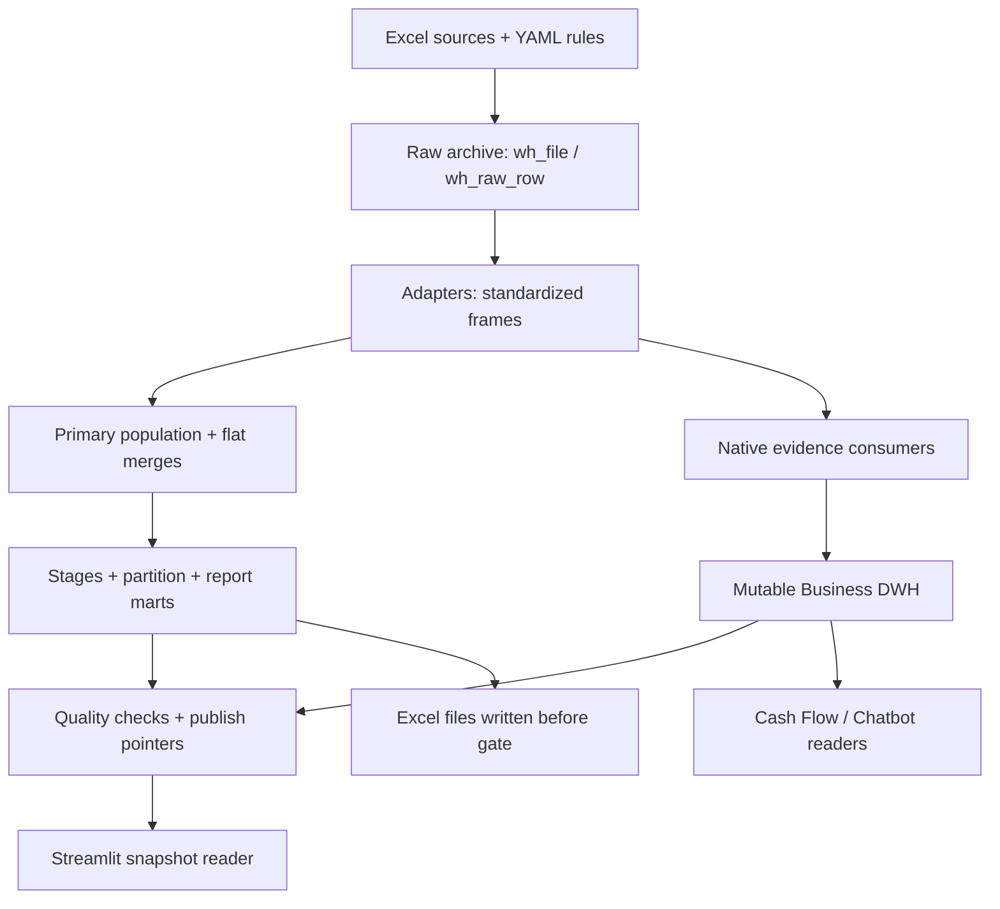

# ARCHITECTURE_BASELINE — GSI V29.7.6 / Phase 0

تاریخ: 2026-09-22 · ورودی: `GSI_V29_7_6_SAP_SEMANTIC_DWH_SMART_CHATBOT.zip`

SHA-256 ZIP: `120cd712b552903008a70cbc49c47dddb0981a48d0a22483cb5e607dc8e07862`

## 1. نتیجه معماری

GSI یک modular Python monolith با Streamlit، pipeline مبتنی بر pandas و چند نسل persistence است. مدل یک star schema یکپارچه نیست: raw archive، serialized DataFrame snapshots، mutable Business DWH، historical warehouse مستقل، و Knowledge Desk SQLite کنار هم وجود دارند. Core فعلی از Excel/files می‌خواند؛ adapter زنده SAP/NTSW/Oracle API در این پکیج مشاهده نشد. اسم source به معنی اتصال مستقیم به ERP نیست.

این مرحله فقط reverse engineering است. هیچ فایل اصلی تغییر نکرده و پیشنهادهای FINDINGS_REGISTER اجرا نشده‌اند. فهرست کامل 521 فایل، 268 فایل Python، 109 سند Markdown، 18 YAML، 29 JSON، 35 log، 21 CSV، 4 workbook، 18 PNG و سایر دارایی‌ها inventory شد. تمام Pythonها AST parse شدند؛ schemaها، maps، test declarations و تنظیمات استخراج شدند. بررسی خط‌به‌خط بر مسیرهای داده و ریسک‌های خواسته‌شده متمرکز بود؛ inventory یا AST scan یک فایل UI به معنی اثبات همه رفتارهای مرورگری آن نیست. تصاویر/screenshots و خروجی‌های قدیمی شواهد اجرای فعلی محسوب نشده‌اند.

سطوح شواهد: **OBSERVED-IN-CODE** (رفتار قابل مشاهده)، **REPRODUCED** (آزمایش synthetic)، **DOCUMENTED-ONLY** (ادعای release/docs)، **UNKNOWN / NEEDS EVIDENCE** (نیازمند فایل واقعی/مالک منبع/محیط استقرار). «source-observed» در این گزارش یعنی کلیدها در همان ردیف native واقعاً مشاهده شده‌اند؛ نام DIRECT_COOBSERVED در DB به‌تنهایی اثبات آن نیست.

## 2. مسیر اجرا و مرزها



- `gsi/__main__.py` و app launchers entrypointها هستند. `Pipeline.run → warehouse.bridge.run_pipeline → Pipeline._run_warehouse` مسیر اصلی است.
- `preflight`: version/contract و rulebook validation و stage graph؛ این‌ها پیش از خواندن داده اجرا می‌شوند.
- `load_sources`: adapter discovery با import/register؛ هر branch جدا try/except؛ روی exception آخرین standardized frame منتشرشده fallback می‌شود. return empty بدون exception fallback ندارد.
- `reader.find_files`: newest mtime، مگر clearance multi_file؛ source bytes ابتدا archive می‌شود تا تغییر همزمان فایل شبکه به دو نسخه در یک ingest منجر نشود.
- raw Excel OOXML برای همه selected files ذخیره می‌شود. مسیر ویژه Oracle/FX/NTSW همه sheets را physical-cell parse و staging می‌کند. بقیه از pandas روی archived bytes و sheets تنظیم‌شده می‌خوانند.
- `build_primary_population`: اجتماع Commercial Expert ORDER و NTSW REG؛ Abbasi فقط برای ORDERهای primary، BLهای مشاهده‌شده را اضافه می‌کند. بنابراین grain flat **یک grain یکنواخت نیست**: ORDER×BL در کنار ORDER بدون BL و REG-only.
- `build_base`: Commercial inventory→SAP main→Oracle→SATA→Clearance→Cotage→DocCheck→IL→FX→Credit طبق registry؛ NTSW commitment/allocation بعد از rematerialize REG.
- stages sorted by order؛ نتیجه row-count باید ثابت باشد جز sort؛ stages tolerant روی exception ستون‌های provides را NA می‌کنند و stage_failures ثبت می‌شود. این به معنی per-domain publish مستقل نیست.
- partition buckets مجموعاً باید برابر df باشند. معیار coverage اکنون primary expert/NTSW است؛ توضیحات بعضی docstringهای قدیمی هنوز Abbasi-spine یا M1 فقط expert را می‌گویند.
- `persist_result`: df/main/to_resolve/excluded/audit/mogh_lines و DataFrame extras به wh_frame/wh_frame_row. report_metadata پیش از ثبت نتیجه نهایی gate نوشته می‌شود.
- سپس native source contracts، drift، runtime failures، process row gate، business DWH و SQLite checks؛ publish report و dwh pointers در یک transaction.
- **مرز انتشار ناقص است:** Excel قبلاً ساخته شده؛ Business DWH قبلاً upsert شده؛ protected pointers به‌تنهایی جلوی مشاهده داده جدید را نمی‌گیرند (F001/F002/F012).

## 3. Raw، Native و Canonical سه مفهوم متفاوت‌اند

| لایه | محل | Grain / هویت | محدودیت |
|---|---|---|---|
| Original bytes | wh_file | SHA256 content | نام فایل ingest در wh_ingest؛ محتوای تکراری یک blob |
| Physical cells | wh_sheet / wh_raw_row | file_id, sheet, physical row | styles/formula/cache/hidden محفوظ؛ این جدول business fact نیست |
| Staging | wh_business_record / wh_measure | file/sheet/row; decimal text measure | عمدتاً Oracle/FX/NTSW special reader |
| Standardized frame | wh_frame + wh_frame_row | run/frame/row ordinal | بعضی adapters پیش از این مرحله aggregate/dedupe کرده‌اند |
| Canonical flat mart | Pipeline df/main | mixed ORDER×BL / ORDER / REG | first-value projection و تکرار مقادیر REG/material روی ردیف‌های متعدد |
| Business evidence | dwh_fact_source_row | source/frame/content-hash | همه frameها native نیستند؛ multiplicity و run membership کامل نیست |
| Business current facts | dwh_fact_* | natural business keys | mutable upsert؛ run-scoped current view تضمین نشده |

Raw archive اجازه replay می‌دهد، اما وجود آن به‌تنهایی به معنی حفظ history در Process Cases یا factهای queryable نیست. شواهد physical row در SAP با SAP_SOURCE_ROW جدید جایگزین می‌شود؛ بسیاری از legacy std mappings metadata را عبور نمی‌دهند. برعکس FX و Oracle بخشی از provenance را حفظ می‌کنند.

## 4. Source Authority و Canonical Resolution

`gsi/config/sources.yaml` / `authority.py`: Tier1=moghavemat,ntsw؛ Tier2=abbasi,sata؛ سایر منابع Tier3. وزن source هنوز compatibility metadata است. sorting stable است و در یک tier ترتیب candidateهای caller تعیین‌کننده است. `CanonicalEntityResolver.resolve` conflict audit می‌سازد و برای ORDER فقط داخل top tier tie-break 8-digit دارد. `DeriveStage` source-prefixed candidateها را authority-sort می‌کند ولی برای هر انتخاب derived، audit مشابه canonical ندارد.

Authority فقط وقتی معنی دارد که **field semantics و grain یکسان** باشند. Currency خرید، Currency تعهد و Currency پروفرما یک field واحد اثبات‌شده نیستند. MATERIAL/MPN، PR/PO/ORDER، REG/REG_FILE به دلیل شباهت نام قابل جانشینی نیستند. `keys.yaml` REG=8 digits و REG_FILE=9+ و PR=10 digits را تعریف می‌کند؛ adapters همیشه از تمام این patternها عبور نمی‌کنند و `_ensure_key` اگر هر ردیف key داشته باشد می‌تواند از ساخت مجدد کل ستون صرف‌نظر کند.

سه resolution policy جدا وجود دارد: canonical/derived tiers؛ population registration bridge؛ Cash Flow SOURCE_PRIORITY. رفتار تعارض و hub priority یکسان نیست (F032). مرجع رسمی domain-by-field، scope قانونی و approved effective dates: **UNKNOWN / NEEDS EVIDENCE**.

## 5. قرارداد هر Source

هر کارت زیر یازده محور درخواستی را جدا ثبت می‌کند. «Native grain» توصیف کد/فایل است؛ هرجا uniqueness در داده واقعی اثبات نشده، صریح مشخص شده است. نبود رکورد در snapshot، بدون قرارداد full extract، حذف کسب‌وکاری تلقی نشده است.

### Commercial Expert / moghavemat

Evidence: `gsi/adapters/moghavemat.py:34` — `MoghavematAdapter`

| Contract | As implemented |
|---|---|
| Native Grain | Expert Data با Data type چندگانه؛ native physical row، احتمال PR/item/partial shipment؛ یکتایی حقوقی UNKNOWN / NEEDS EVIDENCE |
| Business Grain | lines؛ main=ORDER؛ inventory=ORDER×MATERIAL؛ order_material_pr_item=ORDER×MATERIAL×PR×PR_ITEM |
| Primary / Natural Key | raw: file/sheet/row در archive؛ standardized lines فاقد physical row پایدار؛ OMPI_KEY مشتق |
| Measures | PI_LINE_VALUE, PI_ADDITIONAL, QTY_IN_ORDER, QTY_IN_PART, CLEARED_QTY، سه stock bucket |
| Dates | PO_SENT_DATE, SCHEDULED_SHIP, INVENTORY_ASOF_DATE |
| Status Fields | ORDER_STATUS, ADDITIONAL_DATA → STAGE/PROGRESS/BLOCKING/TERMINAL/EXCLUDED_FROM_KPI |
| Duplicate Semantics | main=sum/first_valid؛ inventory=آخرین distinct مقدار به ترتیب فایل نه latest date؛ partial quantities=max per partial part؛ OMPI=evidence_count |
| Deletion Semantics | لغو از parse_status_note/EXCLUDED_FROM_KPI؛ absence tombstone ندارد |
| History Semantics | raw files و run frames محفوظ؛ main/inventory current projections؛ تاریخچه مستقل line version ندارد |
| Authority | Tier 1؛ population builder و موجودی نزد سازنده/راه/گمرک |
| Downstream Consumers | population, canonical keys, Oracle/SAP joins, supply/criticality, OMPI, process, Cash Flow, material search |

### NTSW Import Licence

Evidence: `gsi/adapters/a50_ntsw.py:53` — `NtswAdapter`

| Contract | As implemented |
|---|---|
| Native Grain | physical licence observation؛ workbook original rows preserved |
| Business Grain | import_license evidence، REG_FILE↔REG و ORDER اگر واقعاً در ردیف باشد |
| Primary / Natural Key | REG_FILE+REG declared partial-evidence key؛ uniqueness فقط WARN؛ natural licence/version ID UNKNOWN / NEEDS EVIDENCE |
| Measures | ستون‌های خام نگه داشته می‌شوند؛ fact monetary licence مستقل ساخته نمی‌شود |
| Dates | ستون خام issue/registration؛ adapter NTSW_REG_DATE را صریح map نمی‌کند |
| Status Fields | ستون‌های خام؛ NTSW_STATUS الزاماً ساخته نمی‌شود |
| Duplicate Semantics | rows preserved؛ relation rows upsert و count افزایش می‌یابد |
| Deletion Semantics | absence حذف معنی نمی‌دهد؛ tombstone نیست |
| History Semantics | raw archive + standardized frame؛ DWH membership نقص F002 |
| Authority | Tier 1؛ registration authority و population |
| Downstream Consumers | registration_bridge, population, DWH registration hub, process, cashflow candidate maps |

### NTSW Release Commitment

Evidence: `gsi/adapters/a50_ntsw.py:53` — `NtswAdapter`

| Contract | As implemented |
|---|---|
| Native Grain | row of obligation؛ تکرار snapshot در export UNKNOWN / NEEDS EVIDENCE |
| Business Grain | خروجی commitment=REG summary؛ native commitment rows standardized جدا ندارد |
| Primary / Natural Key | mapped COMMIT_ROW اما aggregate فقط REG؛ PK DWH=reg_key |
| Measures | INITIAL_COMMIT, BALANCE جمع؛ COMMIT_ROWS, OPEN_ROWS |
| Dates | earliest COMMIT_DATE/DEADLINE؛ LAST_COMMIT_DATE=max |
| Status Fields | RELEASE_STATUS؛ unresolved text |
| Duplicate Semantics | هیچ dedupe بر اساس COMMIT_ROW؛ sum تمام rows؛ guard چندارزی کل adapter را raise می‌کند |
| Deletion Semantics | صفر balance/declaration status؛ نبود رکورد tombstone نیست |
| History Semantics | raw wh_business_record/measure محفوظ؛ current aggregate در DWH |
| Authority | Tier 1 |
| Downstream Consumers | commitment/risk, FX, process, cashflow measurement+event, chatbot counts |

### NTSW Allocation

Evidence: `gsi/adapters/a50_ntsw.py:53` — `NtswAdapter`

| Contract | As implemented |
|---|---|
| Native Grain | allocation request observation/status snapshot |
| Business Grain | allocation_rows=current request؛ allocation=REG summary |
| Primary / Natural Key | REG / ROW:REQ_ROW؛ fallback REG/date/amount/currency/type (synthetic, not legal ID) |
| Measures | REQ_AMOUNT, FX_RATE_NUMERIC، allocated/open/rejected/gross amounts |
| Dates | REQ_DATE, APPROVE_DATE, ALLOC_DATE؛ lexicographic tuple after date normalization |
| Status Fields | ALLOC_STATUS, ALLOC_PROCESS → REQUEST_STATE/QUEUE_STATE |
| Duplicate Semantics | latest per request key؛ tie status not separately sequenced؛ fallback may collapse independent same-value requests |
| Deletion Semantics | rejected/cancel classifier؛ no tombstone for absent requests |
| History Semantics | raw preserved؛ standardized only latest ledger + summary |
| Authority | Tier 1 |
| Downstream Consumers | queue/actions, FX, process, cashflow, allocation fact, chatbot |

### SAP

Evidence: `gsi/adapters/a60_finance.py:242` — `SapAdapter`

| Contract | As implemented |
|---|---|
| Native Grain | Data sheet row simultaneously PR item / package-workflow / PO item |
| Business Grain | raw_rows; pr_items=PR×item; po_items=PO×item; workflow_rows=observation; main=latest PR |
| Primary / Natural Key | SAP_SOURCE_ROW=1..N regenerated; PR+PR_ITEM; PO+PO_ITEM; workflow DB hash includes payload+row position |
| Measures | REQ_QTY,QTY_ORDERED,TOTAL_VALUE,VALUATION_PRICE,PACK_QTY,PO_ORDER_QTY,PO_NET_VALUE,PO_GROSS_VALUE؛ PRICE_UNIT denominator, not additive |
| Dates | 8 DATE_FIELDS raw+ISO: requisition/change/release/delivery/order/commission/PO change/doc |
| Status Fields | PROCESSING_STATUS, OVERALL_RELEASE, PACK_PACKED؛ legacy workflow/task/action؛ DELETION_IND/PO_DELETION_IND mapped |
| Duplicate Semantics | current sorted by change-or-release / PO change-or-doc and row number then tail(1)؛ workflow retains rows/fallback pr_items |
| Deletion Semantics | Deletion indicators retained but not used to expire/filter facts; absent rows retained in mutable facts |
| History Semantics | raw workbook retained؛ source-row sequence is not stable event identity؛ current overwrite plus content-hash evidence |
| Authority | Tier 3 complementary؛ SAP native PR/PO facts distinct, authority exception per-domain not centrally defined |
| Downstream Consumers | legacy PR merge, business facts, process planning, chatbot, static operational PR chunks |

### Abbasi / BLs Tracking

Evidence: `gsi/adapters/a10_abbasi.py:23` — `AbbasiAdapter`

| Contract | As implemented |
|---|---|
| Native Grain | tracking observation with BL and ORDER؛ uniqueness UNKNOWN / NEEDS EVIDENCE |
| Business Grain | main remains rows؛ population enrichment dedup ORDER×BL؛ subsequent logistics fields |
| Primary / Natural Key | KEY_BL+KEY_ORDER observed؛ legal BL/order composite cardinality needs source evidence |
| Measures | CONTAINER_20, CONTAINER_40؛ no general additive contract |
| Dates | DISCHARGE_DATE, BL_DELIVERY_DATE, RELEASE_DATE, DO_DATE, WAREHOUSE_RECEIPT |
| Status Fields | STATUS, SHIP_STATUS, TRIP_MODE_CODE |
| Duplicate Semantics | raw/main no adapter dedupe؛ population chooses unique order/BL representatives |
| Deletion Semantics | status retained؛ no deletion lifecycle |
| History Semantics | file/run snapshots only; observations not event change log |
| Authority | Tier 2؛ cannot create primary population |
| Downstream Consumers | primary ORDER→BL enrichment, transport, process shipment, DWH relations |

### SATA

Evidence: `gsi/adapters/a20_sata.py:31` — `SataAdapter`

| Contract | As implemented |
|---|---|
| Native Grain | BL/order/registration/document tracking row |
| Business Grain | native main row؛ flat projection one row/BL |
| Primary / Natural Key | KEY_BL, KEY_ORDER, SATA_KEY_REG; no explicit source natural-key contract |
| Measures | INVOICE_VALUE؛ currency separate |
| Dates | DOC_RECEIVED,DOC_RETURNED,TRACKING_DATE,SENT_TO_BANK,CLOSED_DATE |
| Status Fields | CREDIT_STATUS, NO tracking code, PAY_INSTRUMENT |
| Duplicate Semantics | no native dedupe؛ safe_merge BL keep first if no keep date |
| Deletion Semantics | CLOSED_DATE preserved؛ absence not deletion |
| History Semantics | raw/run frames; no request/document version lifecycle |
| Authority | Tier 2 |
| Downstream Consumers | flat REG fallback, bank/docs, process, DWH ORDER/BL/REG, cashflow maps |

### Oracle

Evidence: `gsi/adapters/a40_oracle.py:23` — `OracleAdapter`

| Contract | As implemented |
|---|---|
| Native Grain | rows of material observations from every sheet carrying شماره فنی؛ location grain unproven |
| Business Grain | main=KEY_MATERIAL union |
| Primary / Natural Key | clean_part_no(شماره فنی)؛ کد جنس mapped but not joining key |
| Measures | STOCK_IKCO, STOCK_SAPCO, DAILY_NEED, CARS_ON_FLOOR, FOREIGN_SHARE |
| Dates | no analytical as-of date mapped; source تاریخ ثبت excluded |
| Status Fields | operational status/critical flags deliberately excluded |
| Duplicate Semantics | within sheet exact logical dedupe then stock sum, need max؛ cross sheet field-wise max |
| Deletion Semantics | absence no tombstone؛ keyless rows issues then not in main |
| History Semantics | raw all cells retained؛ only resolved main persisted standardized |
| Authority | Tier 3؛ specific stock/demand provider |
| Downstream Consumers | flat material join, resistance, supply, material dimension/current fact |

### FX Transaction

Evidence: `gsi/adapters/a60_finance.py:26` — `FxTransactionAdapter`

| Contract | As implemented |
|---|---|
| Native Grain | native financial source row؛ purchase/proforma/SWIFT/receipt fields coexist |
| Business Grain | main valid rows؛ rates=currency median؛ quarantine raw invalid rows |
| Primary / Natural Key | REG or ORDER required; optional BL؛ stable transaction ID not mandatory; physical provenance retained |
| Measures | AMOUNT,RATE,EUR_VALUE,RIAL_VALUE,PAID_AMOUNT/CCY,fees؛ PROFORMA/SWIFT separate |
| Dates | BUY_DATE,ALLOC_VALIDITY,SWIFT_DATE,RECEIPT_DATE |
| Status Fields | STATUS,BENEF_CONFIRM؛ financial posted status not bank-authenticated |
| Duplicate Semantics | native main preserves rows; flat dedupe latest BUY_DATE per REG؛ rate median collapses dates |
| Deletion Semantics | explicit original/target reallocation refs mapped؛ no native deletion/reversal lifecycle |
| History Semantics | physical archive/staging; current evidence frames; purchase invalid/keyless quarantine |
| Authority | Tier 3 complementary finance |
| Downstream Consumers | FX trace, money control, cashflow source facts, rate fallback, process payment |

### Credit

Evidence: `gsi/adapters/a60_finance.py:161` — `CreditAdapter`

| Contract | As implemented |
|---|---|
| Native Grain | LC/remittance observation row in PURCREDIT |
| Business Grain | main rows؛ flat one representative REG |
| Primary / Natural Key | LC_NO mapped; uniqueness not enforced؛ KEY_REG/KEY_ORDER |
| Measures | PROFORMA_VALUE,EUR_AMOUNT,RIAL_AMOUNT,PREPAYMENT,REMAINING,OPEN_PCT |
| Dates | OPEN_YEAR,REG_DATE,FUND_DATE,SWIFT_DATE |
| Status Fields | LAST_STATUS, PAYMENT_TYPE |
| Duplicate Semantics | no native dedupe؛ safe_merge(REG) first row |
| Deletion Semantics | status retained؛ no absence deletion |
| History Semantics | raw/run snapshots, not LC event ledger |
| Authority | Tier 3 |
| Downstream Consumers | credit attributes, FX/funding, process, cashflow FUNDING, relations |

### IL Append

Evidence: `gsi/adapters/a60_finance.py:208` — `IlAppendAdapter`

| Contract | As implemented |
|---|---|
| Native Grain | append/amendment evidence row |
| Business Grain | main source rows؛ flat REG representative |
| Primary / Natural Key | REG_FILE separate from REG؛ ORDER if present؛ amendment ID UNKNOWN / NEEDS EVIDENCE |
| Measures | no measures mapped |
| Dates | REG_DATE |
| Status Fields | REQUEST_TYPE,COMPANY; EX​PERT registration role |
| Duplicate Semantics | duplicates WARN/partial relation evidence؛ flat first REG |
| Deletion Semantics | amendment status not removal; no tombstone |
| History Semantics | raw/run snapshots؛ relations current union |
| Authority | Tier 3؛ derived hub path promoted by resolution logic |
| Downstream Consumers | registration hub, NTSW population bridge, cashflow candidate map |

### Clearance / Customs logistics

Evidence: `gsi/adapters/a30_customs.py:27` — `ClearanceAdapter`

| Contract | As implemented |
|---|---|
| Native Grain | clearance file/declaration/partial-loading row; may have repeated BL |
| Business Grain | main all selected files concatenated؛ flat latest CL_REF_DATE per BL |
| Primary / Natural Key | KEY_BL,KEY_ORDER; FILE_NO,COTAGE_NO retained; native key not enforced |
| Measures | INVOICE_VALUE,EUR_VALUE,RIAL_VALUE,DUTY_AMOUNT,DUTY_RATE,DAMAGE_PCT |
| Dates | REF_DATE,COTAGE_DATE,LICENSE_DATE,DUTY_DATE,LOAD_DATE_1,LOAD_DATE_FINAL→CLEAR_DATE |
| Status Fields | FULL_FLAG/PARTIAL_FLAG→IS_FULL/IS_PARTIAL؛ DONE_NO_DATE |
| Duplicate Semantics | no adapter dedupe؛ largest sheet/file only؛ safe_merge latest BL |
| Deletion Semantics | full/partial marks are observations not deletions؛ export direction absent |
| History Semantics | raw file/cells preserved؛ standardized not all sheets; dates not full event history |
| Authority | Tier 3 |
| Downstream Consumers | customs/transport, clearance timeline, process, risk/FX documents |

### Cottage Tracking / cotage

Evidence: `gsi/adapters/a30_customs.py:141` — `CotageAdapter`

| Contract | As implemented |
|---|---|
| Native Grain | declaration and clearance tracking observation |
| Business Grain | main native rows؛ flat BL representative |
| Primary / Natural Key | KEY_BL; COT_NO mapped; no declaration natural key contract |
| Measures | INVOICE_VALUE,EUR_VALUE,PACK_COUNT,PARTIAL_PCT_1/2 |
| Dates | DOC_DATE,COTAGE_DATE,PARTIAL_DATE_1/2,ABANDONED_DATE,FULL_CLEAR_DATE |
| Status Fields | STATUS,TRANSIT_STATUS,IS_ABANDONED |
| Duplicate Semantics | no native dedupe; first per BL in flat |
| Deletion Semantics | abandonment flag distinct from deletion; no tombstone |
| History Semantics | raw/run snapshots |
| Authority | Tier 3 |
| Downstream Consumers | customs stage, partitions/evidence, process/clearance, invoice fallback |

### Document Checking

Evidence: `gsi/adapters/a60_finance.py:498` — `DocCheckAdapter`

| Contract | As implemented |
|---|---|
| Native Grain | document/check observation row |
| Business Grain | only main=latest ORDER after adapter dedupe |
| Primary / Natural Key | KEY_ORDER; optional BL; native doc identity UNKNOWN / NEEDS EVIDENCE |
| Measures | no money measure |
| Dates | SUBMIT_DATE from Date Received |
| Status Fields | STATUS,DISCREPANCY,DOC_TYPE,REMARK |
| Duplicate Semantics | adapter dedupe latest date per ORDER before downstream evidence |
| Deletion Semantics | none defined |
| History Semantics | raw bytes retain older docs; standardized/process lose prior doc rows |
| Authority | Tier 3 |
| Downstream Consumers | bank-doc stages, process, legacy lead times |

### HR

Evidence: `gsi/adapters/a60_finance.py:543` — `HrAdapter`

| Contract | As implemented |
|---|---|
| Native Grain | employee/org export row؛ current vs historical rows UNKNOWN / NEEDS EVIDENCE |
| Business Grain | main rows; contract one active employee but adapter does not filter active |
| Primary / Natural Key | KEY_EMP via clean_employee_code |
| Measures | none |
| Dates | INACTIVE_DATE |
| Status Fields | STATUS; active count only logged |
| Duplicate Semantics | no dedupe in adapter; duplicates block grain gate |
| Deletion Semantics | inactive date/status retained؛ no SCD2 or tombstone |
| History Semantics | raw/run snapshots; DWH employee identity only, org mapping outside dimensions |
| Authority | Tier 3؛ only YAML required=true source |
| Downstream Consumers | org_mapper, roles/scope, extracts/recipients, personal reports |

### missmohammadi

Evidence: `gsi/config/sources.py:95` — `_load`

| Contract | As implemented |
|---|---|
| Native Grain | UNKNOWN / NEEDS EVIDENCE — disabled registry entry |
| Business Grain | none at runtime |
| Primary / Natural Key | UNKNOWN / NEEDS EVIDENCE |
| Measures | UNKNOWN / NEEDS EVIDENCE |
| Dates | UNKNOWN / NEEDS EVIDENCE |
| Status Fields | UNKNOWN / NEEDS EVIDENCE |
| Duplicate Semantics | not executed |
| Deletion Semantics | not defined |
| History Semantics | not ingested |
| Authority | Tier 3 by default; disabled |
| Downstream Consumers | none observed |

### Cash Flow canonical input / rates / rules

Evidence: `gsi/cashflow/inputs.py:7` — `read_input`

| Contract | As implemented |
|---|---|
| Native Grain | Events and Measurements are separate sheets; Links/ Rates/Rules explicit |
| Business Grain | event_id transaction; measurement metric+case+currency+observed_at; link_id; rate_id |
| Primary / Natural Key | event_id plus source/source_event_id replay guard; no inferred FIFO |
| Measures | Decimal amounts per currency; link from/to amounts; historical valuation via approved rates |
| Dates | event.date, recorded_at, observed_at, due_date; rate.value_date/published_at; rule effective dates |
| Status Fields | POSTED vs SOURCE_FACT vs OBSERVED; approved rates/rules |
| Duplicate Semantics | same event ID conflict quarantine؛ source replay detector؛ measurement snapshots separate |
| Deletion Semantics | REVERSAL is immutable new event; original retained |
| History Semantics | input-driven ledger; Cash Flow engine itself not standalone durable journal store |
| Authority | explicit evidence rules; external legal approval UNKNOWN / NEEDS EVIDENCE |
| Downstream Consumers | cashflow report/UI/HTML/XLSX; DWH bundle; legacy OF remains unverified OBSERVED |

## 6. Facts / Dimensions / Bridges و روابط

Dimensions فعلی اکثراً hubهای هویتی با business_key و first_seen_run/last_seen_run هستند، نه conformed dimensions دارای صفات/SCD2. جدول Date/Currency/Vendor/UOM به‌عنوان dimension منسجم business_dwh مشاهده نشد. typed measureها عمدتاً داخل JSON payload هستند. Oracle material و supply-position current facts هستند؛ SAP PR/PO item snapshot، workflow observation، NTSW allocation request و REG commitment facts مستقل دارند.

| Relation | Evidence class | آنچه کد واقعاً می‌کند / محدودیت |
|---|---|---|
| Commercial line ORDER–MATERIAL–PR–item | Source-observed candidate | فقط وقتی هم‌ردیف native و semantic keys درست باشد؛ OMPI خلاصه multiplicity را نگه می‌دارد |
| SAP raw PR–PO / PR–MATERIAL / PO–MATERIAL | Co-observed candidate, not automatically proven business relation | header PR/material با po.* ممکن است متفاوت باشد؛ F017 |
| Abbasi ORDER–BL | Source-observed candidate | فقط از tracking row؛ N:M ممکن و باید اندازه‌گیری شود |
| SATA BL–REG و ORDER–REG | Source-observed candidate | وجود در source معلوم؛ uniqueness/global authority را اثبات نمی‌کند |
| NTSW REG_FILE–REG | Source-observed candidate | partial evidence نگه داشته می‌شود؛ ambiguity needs diagnostics |
| IL REG_FILE–ORDER | Source-observed candidate | amendment version و scope نیازمند داده واقعی |
| ORDER→REG از NTSW REG_FILE + IL REG_FILE | **Derived relation/path** | exact key join است ولی در یک source row مشاهده نشده؛ equal-priority ambiguity در population قرنطینه می‌شود |
| dwh_registration_hub REG×ORDER | **Derived view** | دو LEFT JOIN روی REG_FILE؛ چند REG و چند ORDER تمام ترکیب‌ها را می‌سازند؛ attribution قطعی نیست |
| Process connected component | **Derived grouping** | اتحاد تمام entity keys؛ اشتراک material/employee پرونده یکسان را ثابت نمی‌کند |
| canonical winner | **Resolved value** | باید original candidates/conflicts محفوظ باشند؛ winner شاهد جدید نیست |
| logistics bucket از تاریخ/quantity | **Derived classification** | مقدار/مکان inferred است، observed stock صریح نیست |
| Cashflow source-row purchase→payment | **Derived flow attribution with same-row evidence** | engine فقط با amount/currency/link rules می‌پذیرد؛ source row به‌تنهایی اثبات حسابداری بانکی نیست |

DIRECT_PAIRS واقعی: ORDER–MATERIAL، ORDER–PR، PR–MATERIAL، PR–PO، PO–MATERIAL، ORDER–BL، BL–REG، ORDER–REG، REG_FILE–REG، REG_FILE–ORDER، ORDER–EMP. **PO–REG_FILE در این فهرست نیست**، با وجود اینکه SAP آن کلید را می‌خواند؛ وجود ستون به معنی وجود relation/consumer نیست. Business relation table physical row reference ندارد؛ evidence_count مجموع upsertها از چند frame/run است، نه تعداد مستقل اسناد.

## 7. Process Evidence / Cases / Stage Matrix در برابر Event Log قدیمی

`ProcessIntegrityStage` در order 54 از source frames استفاده می‌کند. `_observations` برای هر frame row یک SOURCE_OBSERVATION و چند stage observation می‌سازد؛ keylessها ORPHAN_NO_BUSINESS_KEY هستند. SAP main وقتی workflow موجود است حذف می‌شود ولی raw/pr_items/workflow/po_items همگی generic observations دارند. سایر derived frames نیز observations محسوب می‌شوند. بنابراین expected_native_rows واقعاً **تعداد frame-rowهای ورودی** است، نه physical source rows.

STAGES: PLANNING_PR → EXPERT_INTAKE → ORDER_CREATED → REGISTRATION → ALLOCATION_REQUEST → ALLOCATION → COMMITMENT → FX_PURCHASE → FUNDING → PAYMENT → SHIPMENT → CUSTOMS → CLEARANCE → BANK_DOCS → SETTLEMENT. این ترتیب یک control template است و صحت الزام ترتیب برای همه معاملات اثبات نشده است. stage observed به معنی completed نیست. missing predecessor به EVIDENCE_GAP تبدیل می‌شود؛ منبع غایب stage را NOT_MEASURED می‌کند، اما تشخیص availability در سطح کل source است، نه sheet/field لازم.

Cases با union-find از entity keys ساخته می‌شوند و ID hash همه اعضای component است؛ افزودن relation می‌تواند case ID را عوض کند. Stage matrix برای هر case تمام stages را دارد. LAST_EVIDENCE_DATE=max رشته‌های raw است، نه الزاماً max تاریخ یکدست. attach_process_state ابتدا REG سپس ORDER سپس PR سپس BL سپس MATERIAL را می‌آزماید؛ انطباق اولین identifier کافی تلقی می‌شود و تضاد identifiers بعدی الزاماً سنجیده نمی‌شود.

مسیر دوم `s80_eventlog` از **flat domain dates**، CASE_KEY، variants، throughput، rework و terminal activity تولید می‌کند؛ `s85_conformance` آن را می‌سنجد. این مسیر همان process_evidence ledger نیست. نبود تاریخ در flat، eventها را کم می‌کند و semantic mappingهای F021/F022 مستقل از صحت raw هستند. شواهد repeated snapshots، workflow observations و رخدادهای immutable نباید یک count واحد داشته باشند.

## 8. Cash Flow و مالی

سه مسیر مالی هم‌زمان وجود دارد:

1. `s50_commitment` و `s55_fx_traceability`/`s56_money_flow_control`: legacy summary و event/money ledgers در extras، عمدتاً float و REG-grain. native frames برای اجتناب از fan-out استفاده می‌شوند اما missing→zero در بعضی نقاط برقرار است.
2. `warehouse/fx_obligation.py`: chain/totals روی raw staged business records و measures؛ run selection صحیح ندارد (F023).
3. `cashflow/engine.py`: Decimal evidence engine با Events، Measurements، Links، Rates، Rules؛ imported canonical workbook یا DWH bundle. balance snapshot از incremental event جداست. مبنای ورود POSTED یا SOURCE_FACT + date/source/document/amount است؛ OBSERVED از محاسبه کنار می‌رود. بدون حساب واقعی OWN گردش بانک ساخته نمی‌شود؛ reversal، source replay، overlink، currency conversion pair و authorization cross-case کنترل می‌شوند.

DWH bundle همه مراحل سامانه‌ها را به‌صورت کامل پوشش نمی‌دهد: commercial REGISTRATION، allocation QUEUE/ALLOCATION، commitment event+measurement، FX purchase/payment، credit funding را می‌سازد. از صرف وجود adapter clearance، Cash Flow event CLEARANCE تولیدشده نتیجه نمی‌شود. Customs/shipments/settlement links واقعی برای زنجیره کامل: **UNKNOWN / NEEDS EVIDENCE** مگر canonical input آن را بدهد.

نرخ تاریخی باید currency pair، date، purpose، regime، approval و age داشته باشد؛ فایل Exchange Rates فقط reference import است و approved=false می‌ماند. وجود قواعد YAML یا نام سامانه به معنی اعتبار قانونی/نرخ زنده نیست. این ممیزی تحلیل حقوقی یا صحت بخشنامه‌ها نیست.

## 9. Snapshot / Publication / Failure model

`wh_run` running→completed/failed، `wh_quality_check` و `wh_current(report,dwh)` مدل عملیاتی‌اند. failed gate معمولاً run را completed با quality failure باقی می‌گذارد و `publish` exception می‌دهد؛ completed به معنی published نیست. WriterLock اجراها را محدود می‌کند و SQLite WAL/read-only readers contention را کاهش می‌دهند. DataFrame pickle cache disposable خوانده می‌شود و صحت checksum مستقل برای cached frame در read مسیر مشاهده نشد؛ DB fallback row-count را می‌سنجد.

Missing source، stale fallback، schema drift، invalid grain، source load failure و stage exception statusهای متفاوت دارند ولی همگی به gate یکسان وصل نیستند. Schema baseline اولین بار **پیش از قبولی انتشار** نوشته می‌شود؛ نام «accepted baseline» در docstring ضمانت lifecycle نیست. افزودن source/domain بدون تغییر severity gate ممکن نیست. نبود explicit contract INFO/True است. FATAL/CRITICAL/BLOCK شکست publication جهانی را مسدود می‌کنند؛ WARN/DEGRADED خیر.

`historical_store.py` سیستم دیگری با dw_run، fact_case_snapshot، fact_event/bridge_run_event، transitions، conformance، KPI snapshot و case_state_log است؛ lifecycle wrapper آن در Pipeline فعلی وصل نیست. ذخیره همه history را نمی‌توان از وجود این فایل نتیجه گرفت.

## 10. Streamlit / Reporting / Chatbot / Knowledge Base

- `app/run_platform.py`, `run_dashboard.py`, `app/studio.py`, `dashboard.py`؛ Studio اول published report هم‌تاریخ را می‌خواند و سپس در نبود آن Pipeline اجرا می‌کند. روی busy/gate-blocked به آخرین report برمی‌گردد و stale flag دارد. cache_data keyed by reference date به source/config fingerprint گره نخورده است؛ refresh explicit اهمیت دارد.
- `studio_core` شامل metric/grain registry، filters، composer/report builder، HTML/Excel/PDF exports، access controls و runtime data است. وجود registry جلوی تمام double counting را در consumers مستقیم pandas نمی‌گیرد. `semantic_metrics` برای نام ناشناخته default additive دارد و PRICE نیز در additive heuristic است؛ سنجه جدید نیازمند explicit contract است.
- Reports: Excel dashboard، extracts، financial/supply/material views، personal snapshots، control center مخاطب/cluster و Outlook/SMTP integration. هیچ ایمیلی در این ممیزی ارسال نشده است. کنترل ارسال/ACL واقعی محیط ارزیابی نشده.
- Knowledge Desk: فایل‌های پشتیبانی‌شده → parser/chunker → kb_documents/kb_chunks → FTS5 یا LIKE. root/path topology و self-index guard وجود دارد. kb_questions متن سؤال/پاسخ را ثبت می‌کند. پاسخ local **extractive** است و LLM generation نیست.
- `operational_search` برای شناسه‌های عددی به Business DWH می‌رود؛ PR پاسخ richer، سایر entities relations-only. ادعای as-of را باید با F001 محدود دانست. حد static operational PRها 20000 است؛ generic PO/ORDER snapshot مستقل در static export نیست.
- `static_export` همه chunks منتخب را در HTML/JSON می‌گذارد و پس از publish خودکار live نمی‌شود. منابع document source_type دارند، اما matching چند کلمه تضمین entailment نیست.
- AnythingLLM integration مستقل و اختیاری است؛ API key server-side و embed config public جدا شده‌اند. مدل، prompt اصلی workspace، retrieval settings، user permissions و hallucination metrics بیرون پکیج: **UNKNOWN / NEEDS EVIDENCE**.

## 11. نقاط قوت اثبات‌شده

raw original bytes و physical-cell evidence؛ numeric parsing جدا برای مالی حساس؛ تفکیک REG/REG_FILE؛ quarantine FX invalid amounts؛ استقلال native facts از flat join؛ missing inventory ≠ zero در Oracle/supply؛ نگهداری OMPI و SAP PR/PO grains؛ pointer publication gate؛ read-only readers و lazy extras؛ native Cash Flow measurements/events؛ عدم fallback تصادفی به شیت اول برای شیت صریح؛ تشخیص ambiguity در registration bridge. این کنترل‌ها ارزشمندند اما نقایص یافته‌شده را خنثی نمی‌کنند.

## 12. نیازهای اثبات‌نشده

source exports با چند snapshot متوالی، data dictionary رسمی، IDs line/transaction/event، full-vs-delta contract، currency/UOM semantics، روابط legal order↔REG↔BL، native SAP deletion/version fields، process variantهای مجاز، source freshness SLA، دامنه‌های مجاز انتشار مستقل، نمونه DB ارتقایافته و deployment/ACL. داده‌های واقعی 17 منبع در ZIP وجود ندارد؛ چهار XLSX موجود خروجی QA/نمونه Cash Flow هستند. `REAL_INPUT_VALIDATION.json` یک ادعای historical درباره چهار ورودی و 1815 ردیف است، نه نتیجه اجرای فعلی این ممیزی.

## Appendix A — Stage contracts extracted from code

| File / class | Declared order/name/tolerance | Requires / Provides |
|---|---|---|
| `gsi/stages/s10_resolve.py` / ResolveStage | 10; 'resolve'; tolerant=False (base) | requires: `[KEY_BL, KEY_ORDER]`; provides: `['CANONICAL_BL', 'CANONICAL_ORDER', 'CANONICAL_PART_NO', 'CANONICAL_GOODS_DESC', 'CANONICAL_EXPERT', 'EXPERT_ROLE', 'CANONICAL_REG']` |
| `gsi/stages/s20_derive.py` / DeriveStage | 20; 'derive'; tolerant=False (base) | requires: `[]`; provides: `list(DERIVED) + list(BOOLS)` |
| `gsi/stages/s30_org.py` / OrgStage | 30; 'org'; tolerant=False (base) | requires: `['CANONICAL_EXPERT', KEY_EMP]`; provides: `['ORG_VICE', 'ORG_DEPT', 'ORG_MANAGER', 'ORG_HEAD', 'ORG_MATCH', 'ORG_CHAIN']` |
| `gsi/stages/s35_scope.py` / ScopeStage | 35; 'scope'; tolerant=False (base) | requires: `['CANONICAL_EXPERT']`; provides: `[s.key for s in SCOPES] + [OWNER_NAME, OWNER_SOURCE, OWNER_GAP, MISSING_SOURCE] + ps.OUTPUT_COLUMNS` |
| `gsi/stages/s38_supply_position.py` / SupplyPositionStage | 38; 'supply_position'; tolerant=False (base) | requires: `['STOCK_IKCO', 'STOCK_SAPCO', 'SUPPLIER_QTY', 'IN_TRANSIT_QTY', 'IN_CUSTOMS_QTY', 'DAILY_NEED']`; provides: `['SUPPLY_ORACLE_STOCK', 'SUPPLY_EXPERT_STOCK', 'SUPPLY_TOTAL_CONFIRMED', 'SUPPLY_TOTAL_LOWER_BOUND', 'SUPPLY_POSITION_COVERAGE_PCT', 'SUPPLY_POSITION_STATUS', 'SUPPLY_POSITION_GAPS', 'SUPPLY_POSITION_LINEAGE', 'SUPPLY_EXPERT_COVERAGE_PCT', 'SUPPLY_ORACLE_COVERAGE_PCT', 'SUPPLY_POSITION_CONFLICT', 'SUPPLY_POSITION_ASOF']` |
| `gsi/stages/s39_warehouse_declaration.py` / WarehouseDeclarationStage | 39; 'warehouse_declaration'; tolerant=False (base) | requires: `['WAREHOUSE_RECEIPT']`; provides: `['WH_RECEIPT_DATE', 'WH_DECLARED', 'WH_CLEAR_DATE', 'WH_CLEAR_BASIS', 'WH_LAG_DAYS', 'WH_AGE_DAYS', 'WH_STATUS', 'WH_STATUS_FA', 'WH_GAP_REASON', 'WH_RULE_BASIS']` |
| `gsi/stages/s40_criticality.py` / CriticalityStage | 40; 'criticality'; tolerant=False (base) | requires: `['STOCK_IKCO', 'STOCK_SAPCO', 'SUPPLIER_QTY', 'IN_TRANSIT_QTY', 'IN_CUSTOMS_QTY', 'DAILY_NEED']`; provides: `['مقاومت (روز)', 'مقاومت انبار (روز)', 'طبقه بحرانی', 'بحرانی (کوتاه)', 'کد طبقه بحرانی', 'CRITICALITY_SORT', 'اقدام پیشنهادی مقاومت', 'موجودی ایران خودرو', 'موجودی ساپکو', 'موجودی نزد سازنده', 'موجودی کل قابل احتساب', 'حداقل موجودی قابل اثبات', 'پوشش اجزای موجودی (٪)', 'شکاف اجزای موجودی', 'نیاز روزانه', 'موجودی در راه', 'موجودی در گمرک', 'مقاومت انبار (روز)', 'مقاومت ایران خودرو (روز)', 'مقاومت ساپکو (روز)', 'مقاومت نزد سازنده (روز)', 'مقاومت در راه (روز)', 'مقاومت در گمرک (روز)', 'PART_CRITICALITY_SCORE', 'BL_CRITICAL', 'BL_CRITICAL_LEVEL', 'BL_CRITICAL_MATERIALS', 'BL_CRITICAL_REASON', 'ORDER_CRITICAL', 'ORDER_CRITICAL_LEVEL', 'ORDER_CRITICAL_MATERIALS', 'ORDER_CRITICAL_REASON']` |
| `gsi/stages/s50_commitment.py` / CommitmentStage | 50; 'commitment'; tolerant=False (base) | requires: `['SEGMENT', 'CB_DATE', 'BALANCE']`; provides: `['نوع پرونده', 'کد سگمنت', 'روش پرداخت', 'نوع ترخیص', 'برات/یوزانس', 'مهلت قانونی رفع تعهد', 'روزهای تأخیر', 'مانده تعهد', 'جریمه برآوردی', 'وضعیت کلی هشدار', 'شرح هشدارها', 'مبنای مهلت تعهد', 'مبنای جریمه', 'LEGAL_DEADLINE_DAYS']` |
| `gsi/stages/s54_process_integrity.py` / ProcessIntegrityStage | 54; 'process_integrity'; tolerant=True | requires: `[]`; provides: `['PROCESS_CASE_ID', 'PROCESS_CASE_COUNT', 'PROCESS_STATUS', 'PROCESS_CURRENT_STAGE', 'PROCESS_CURRENT_OWNER', 'PROCESS_GAPS', 'PROCESS_LAST_EVIDENCE_DATE', 'PROCESS_EVIDENCE_COUNT']` |
| `gsi/stages/s55_fx_traceability.py` / FxTraceabilityStage | 55; 'fx_traceability'; tolerant=True | requires: `['CANONICAL_REG']`; provides: `['FX_CASE_KEY', 'FX_PURCHASED_AMOUNT', 'FX_RIAL_OUTFLOW_REPORTED', 'FX_NTSW_INITIAL', 'FX_NTSW_RELEASED', 'FX_NTSW_BALANCE', 'FX_MONEY_STAGE', 'FX_CUSTOMS_DOC_OBLIGATION', 'FX_DIFFERENTIAL_OBLIGATION', 'FX_COLLATERAL_STATUS', 'FX_ALLOCATION_ROUTE', 'FX_TRACE_SCORE', 'FX_ANOMALY_COUNT', 'FX_ANOMALIES', 'FX_EVIDENCE_STATUS']` |
| `gsi/stages/s56_money_flow_control.py` / MoneyFlowControlStage | 56; 'money_flow_control'; tolerant=True | requires: `['FX_CASE_KEY', 'FX_TRACE_SCORE', 'FX_ANOMALY_COUNT']`; provides: `['FX_CONTROL_RISK_SCORE', 'FX_CONTROL_RISK_BAND', 'FX_DEADLINE_DATE', 'FX_DAYS_REMAINING', 'FX_DEADLINE_STATUS', 'FX_DEADLINE_BASIS', 'FX_CURRENT_STAGE', 'FX_STAGE_PROGRESS_PCT', 'FX_REALLOCATION_STATUS', 'FX_REALLOCATION_COUNT', 'FX_UNAUTHORIZED_REALLOCATION_COUNT', 'FX_CONVERSION_STATUS', 'FX_CONVERSION_IMPACT_RIAL', 'FX_PURCHASE_WAVG_RATE', 'FX_SUPPLIER_CURRENCIES', 'FX_MONEY_RECON_STATUS', 'FX_MONEY_EVIDENCE_GAPS', 'FX_OBLIGATION_RECON_STATUS']` |
| `gsi/stages/s57_legacy_knowledge.py` / LegacyKnowledgeTransferStage | 57; 'legacy_knowledge_transfer'; tolerant=True | requires: `['FX_CASE_KEY']`; provides: `['FX_KNOWLEDGE_SIGNAL_COUNT', 'FX_ROOT_CAUSE_HINTS', 'FX_EVIDENCE_REQUIREMENTS', 'FX_KNOWLEDGE_PROVENANCE', 'FX_RATE_SEMANTIC_GAPS', 'FX_PAYMENT_WITHOUT_BL_SIGNAL', 'FX_LEGACY_RULE_GUARD']` |
| `gsi/stages/s58_case_actions.py` / CaseActionStage | 58; 'case_actions'; tolerant=True | requires: `['FX_CASE_KEY', 'FX_CURRENT_STAGE']`; provides: `['NEXT_ACTION_ID', 'NEXT_ACTION_PRIORITY', 'NEXT_ACTION_TITLE', 'NEXT_ACTION_OWNER', 'NEXT_ACTION_DUE_DATE', 'NEXT_ACTION_DAYS', 'NEXT_ACTION_EVIDENCE_GAPS', 'NEXT_ACTION_RULE_BASIS', 'NEXT_ACTION_EMAIL_READY', 'CASE_ACTION_COUNT']` |
| `gsi/stages/s60_narrate.py` / NarrateStage | 60; 'narrate'; tolerant=False (base) | requires: `['CANONICAL_BL', 'COTAGE_NO', 'SATA_NO', 'DISCHARGE_DATE', 'وضعیت کلی هشدار']`; provides: `['روایت اختصاصی بارنامه', 'پیشنهاد عملیاتی هوش مصنوعی', 'درصد قطعیت', 'روزهای رسوب', 'وضعیت هوشمند', 'احتمال بقای ویبول (٪)', 'احتمال حضور در گمرک (٪)', 'وضعیت سیستمی دوگانه']` |
| `gsi/stages/s70_risk.py` / RiskStage | 70; 'risk'; tolerant=False (base) | requires: `['روزهای رسوب', 'جریمه برآوردی', 'CB_VALUE', 'PART_CRITICALITY_SCORE', 'LEGAL_DEADLINE_DAYS']`; provides: `['امتیاز ریسک', 'طبقه ریسک', 'هشدار ترکیبی بحرانی', 'اقدام هشدار ترکیبی']` |
| `gsi/stages/s80_eventlog.py` / EventLogStage | 80; 'eventlog'; tolerant=True | requires: `['CANONICAL_ORDER', 'BL_DATE']`; provides: `['CASE_KEY', 'CASE_KEY_BASIS', 'THROUGHPUT_DAYS', 'CASE_AGE_DAYS', 'CURRENT_WAIT_DAYS', 'CASE_STATE', 'VARIANT', 'EVENT_COUNT', 'SOURCE_ROW_COUNT', 'REWORK_COUNT', 'PROCESS_COMPLETENESS', 'ORDER_CERTAIN']` |
| `gsi/stages/s85_conformance.py` / ConformanceStage | 85; 'conformance'; tolerant=True | requires: `['CANONICAL_ORDER']`; provides: `['انحراف فرآیند', 'فعالیت\u200cهای جاافتاده', 'نقض ترتیب', 'امتیاز انطباق (٪)', 'عوامل همراه با انحراف']` |
| `gsi/stages/s90_sort.py` / SortStage | 90; 'sort'; tolerant=False (base) | requires: `['CRITICALITY_SORT', 'امتیاز ریسک']`; provides: `[]` |

## Appendix B — SQLite DDL inventory

DDLهای زیر مستقیماً از string literalهای کد استخراج شده‌اند؛ وجود در تعریف با ساخت آن جدول در runtime یکسان نیست.

### `gsi/knowledge_desk/indexer.py`

```sql
CREATE TABLE IF NOT EXISTS kb_meta(key TEXT PRIMARY KEY, value TEXT NOT NULL);
CREATE TABLE IF NOT EXISTS kb_documents(
      document_id INTEGER PRIMARY KEY AUTOINCREMENT,
      path TEXT NOT NULL UNIQUE,
      source_type TEXT NOT NULL,
      title TEXT NOT NULL,
      file_hash TEXT NOT NULL,
      mtime_ns INTEGER NOT NULL,
      size_bytes INTEGER NOT NULL,
      status TEXT NOT NULL DEFAULT 'ACTIVE',
      indexed_at TEXT NOT NULL DEFAULT CURRENT_TIMESTAMP,
      error TEXT
    );
CREATE TABLE IF NOT EXISTS kb_chunks(
      chunk_id INTEGER PRIMARY KEY AUTOINCREMENT,
      document_id INTEGER NOT NULL,
      chunk_no INTEGER NOT NULL,
      body TEXT NOT NULL,
      FOREIGN KEY(document_id) REFERENCES kb_documents(document_id) ON DELETE CASCADE,
      UNIQUE(document_id, chunk_no)
    );
CREATE TABLE IF NOT EXISTS kb_quarantine(
      quarantine_id INTEGER PRIMARY KEY AUTOINCREMENT,
      path TEXT NOT NULL,
      source_type TEXT,
      reason_code TEXT NOT NULL,
      detail TEXT,
      detected_at TEXT NOT NULL DEFAULT CURRENT_TIMESTAMP
    );
CREATE TABLE IF NOT EXISTS kb_questions(
      question_id INTEGER PRIMARY KEY AUTOINCREMENT,
      question TEXT NOT NULL,
      answer TEXT,
      sources_json TEXT,
      status TEXT NOT NULL DEFAULT 'ANSWERED',
      created_at TEXT NOT NULL DEFAULT CURRENT_TIMESTAMP
    );
```

### `gsi/personalization/store.py`

```sql
CREATE TABLE IF NOT EXISTS meta(
                key TEXT PRIMARY KEY,
                value TEXT NOT NULL
            );
CREATE TABLE IF NOT EXISTS kv(
                namespace TEXT NOT NULL,
                key TEXT NOT NULL,
                value_json TEXT NOT NULL,
                updated_at TEXT NOT NULL,
                PRIMARY KEY(namespace,key)
            );
CREATE TABLE IF NOT EXISTS audit(
                id INTEGER PRIMARY KEY AUTOINCREMENT,
                ts TEXT NOT NULL,
                event TEXT NOT NULL,
                detail_json TEXT NOT NULL
            );
```

### `gsi/warehouse/business_dwh.py`

```sql
CREATE TABLE IF NOT EXISTS dwh_entity(
 entity_type TEXT NOT NULL,
 business_key TEXT NOT NULL,
 first_seen_run TEXT NOT NULL REFERENCES wh_run(id),
 last_seen_run TEXT NOT NULL REFERENCES wh_run(id),
 PRIMARY KEY(entity_type,business_key));
CREATE TABLE IF NOT EXISTS dwh_dim_order(
 order_key TEXT PRIMARY KEY,
 first_seen_run TEXT NOT NULL REFERENCES wh_run(id),
 last_seen_run TEXT NOT NULL REFERENCES wh_run(id));
CREATE TABLE IF NOT EXISTS dwh_dim_material(
 material_key TEXT PRIMARY KEY,
 first_seen_run TEXT NOT NULL REFERENCES wh_run(id),
 last_seen_run TEXT NOT NULL REFERENCES wh_run(id));
CREATE TABLE IF NOT EXISTS dwh_dim_bl(
 bl_key TEXT PRIMARY KEY,
 first_seen_run TEXT NOT NULL REFERENCES wh_run(id),
 last_seen_run TEXT NOT NULL REFERENCES wh_run(id));
CREATE TABLE IF NOT EXISTS dwh_dim_registration(
 reg_key TEXT PRIMARY KEY,
 first_seen_run TEXT NOT NULL REFERENCES wh_run(id),
 last_seen_run TEXT NOT NULL REFERENCES wh_run(id));
CREATE TABLE IF NOT EXISTS dwh_dim_registration_file(
 reg_file_key TEXT PRIMARY KEY,
 first_seen_run TEXT NOT NULL REFERENCES wh_run(id),
 last_seen_run TEXT NOT NULL REFERENCES wh_run(id));
CREATE TABLE IF NOT EXISTS dwh_dim_pr(
 pr_key TEXT PRIMARY KEY,
 first_seen_run TEXT NOT NULL REFERENCES wh_run(id),
 last_seen_run TEXT NOT NULL REFERENCES wh_run(id));
CREATE TABLE IF NOT EXISTS dwh_dim_po(
 po_key TEXT PRIMARY KEY,
 first_seen_run TEXT NOT NULL REFERENCES wh_run(id),
 last_seen_run TEXT NOT NULL REFERENCES wh_run(id));
CREATE TABLE IF NOT EXISTS dwh_dim_employee(
 emp_key TEXT PRIMARY KEY,
 first_seen_run TEXT NOT NULL REFERENCES wh_run(id),
 last_seen_run TEXT NOT NULL REFERENCES wh_run(id));
CREATE TABLE IF NOT EXISTS dwh_relation(
 left_type TEXT NOT NULL,
 left_key TEXT NOT NULL,
 right_type TEXT NOT NULL,
 right_key TEXT NOT NULL,
 source TEXT NOT NULL,
 frame TEXT NOT NULL,
 rule TEXT NOT NULL,
 first_seen_run TEXT NOT NULL REFERENCES wh_run(id),
 last_seen_run TEXT NOT NULL REFERENCES wh_run(id),
 evidence_count INTEGER NOT NULL DEFAULT 1,
 PRIMARY KEY(left_type,left_key,right_type,right_key,source,frame,rule),
 FOREIGN KEY(left_type,left_key) REFERENCES dwh_entity(entity_type,business_key),
 FOREIGN KEY(right_type,right_key) REFERENCES dwh_entity(entity_type,business_key));
CREATE INDEX IF NOT EXISTS dwh_relation_left ON dwh_relation(left_type,left_key);
CREATE INDEX IF NOT EXISTS dwh_relation_right ON dwh_relation(right_type,right_key);
CREATE TABLE IF NOT EXISTS dwh_fact_source_row(
 source TEXT NOT NULL,
 frame TEXT NOT NULL,
 row_hash TEXT NOT NULL,
 payload TEXT NOT NULL,
 first_seen_run TEXT NOT NULL REFERENCES wh_run(id),
 last_seen_run TEXT NOT NULL REFERENCES wh_run(id),
 PRIMARY KEY(source,frame,row_hash));
CREATE TABLE IF NOT EXISTS dwh_fact_supply_position(
 order_key TEXT NOT NULL REFERENCES dwh_dim_order(order_key),
 material_key TEXT NOT NULL REFERENCES dwh_dim_material(material_key),
 payload TEXT NOT NULL,
 last_seen_run TEXT NOT NULL REFERENCES wh_run(id),
 PRIMARY KEY(order_key,material_key));
CREATE TABLE IF NOT EXISTS dwh_bridge_order_material_pr_item(
 order_key TEXT NOT NULL REFERENCES dwh_dim_order(order_key),
 material_key TEXT NOT NULL REFERENCES dwh_dim_material(material_key),
 pr_key TEXT NOT NULL REFERENCES dwh_dim_pr(pr_key),
 pr_item TEXT NOT NULL DEFAULT '',
 evidence_count INTEGER NOT NULL DEFAULT 1,
 source_rows TEXT NOT NULL DEFAULT '',
 payload TEXT NOT NULL,
 last_seen_run TEXT NOT NULL REFERENCES wh_run(id),
 PRIMARY KEY(order_key,material_key,pr_key,pr_item));
CREATE INDEX IF NOT EXISTS dwh_ompi_order_material ON dwh_bridge_order_material_pr_item(order_key,material_key);
CREATE INDEX IF NOT EXISTS dwh_ompi_pr ON dwh_bridge_order_material_pr_item(pr_key);
CREATE TABLE IF NOT EXISTS dwh_fact_oracle_material(
 material_key TEXT PRIMARY KEY REFERENCES dwh_dim_material(material_key),
 payload TEXT NOT NULL,
 last_seen_run TEXT NOT NULL REFERENCES wh_run(id));
CREATE TABLE IF NOT EXISTS dwh_fact_sap_pr_item(
 pr_key TEXT NOT NULL REFERENCES dwh_dim_pr(pr_key),
 pr_item TEXT NOT NULL DEFAULT '',
 material_key TEXT,
 payload TEXT NOT NULL,
 last_seen_run TEXT NOT NULL REFERENCES wh_run(id),
 PRIMARY KEY(pr_key,pr_item));
CREATE INDEX IF NOT EXISTS dwh_sap_pr_material ON dwh_fact_sap_pr_item(material_key);
CREATE TABLE IF NOT EXISTS dwh_fact_sap_po_item(
 po_key TEXT NOT NULL REFERENCES dwh_dim_po(po_key),
 po_item TEXT NOT NULL DEFAULT '',
 pr_key TEXT,
 pr_item TEXT NOT NULL DEFAULT '',
 material_key TEXT,
 payload TEXT NOT NULL,
 last_seen_run TEXT NOT NULL REFERENCES wh_run(id),
 PRIMARY KEY(po_key,po_item));
CREATE INDEX IF NOT EXISTS dwh_sap_po_pr ON dwh_fact_sap_po_item(pr_key,pr_item);
CREATE TABLE IF NOT EXISTS dwh_fact_sap_workflow(
 workflow_key TEXT PRIMARY KEY,
 pr_key TEXT NOT NULL REFERENCES dwh_dim_pr(pr_key),
 pr_item TEXT NOT NULL DEFAULT '',
 event_date TEXT,
 payload TEXT NOT NULL,
 last_seen_run TEXT NOT NULL REFERENCES wh_run(id));
CREATE INDEX IF NOT EXISTS dwh_sap_workflow_pr ON dwh_fact_sap_workflow(pr_key,event_date);
CREATE TABLE IF NOT EXISTS dwh_fact_ntsw_allocation_request(
 request_key TEXT PRIMARY KEY,
 reg_key TEXT NOT NULL REFERENCES dwh_dim_registration(reg_key),
 payload TEXT NOT NULL,
 last_seen_run TEXT NOT NULL REFERENCES wh_run(id));
CREATE TABLE IF NOT EXISTS dwh_fact_ntsw_commitment(
 reg_key TEXT PRIMARY KEY REFERENCES dwh_dim_registration(reg_key),
 payload TEXT NOT NULL,
 last_seen_run TEXT NOT NULL REFERENCES wh_run(id));
CREATE TABLE IF NOT EXISTS dwh_unresolved_relation(
 id INTEGER PRIMARY KEY,
 run_id TEXT NOT NULL REFERENCES wh_run(id),
 source TEXT NOT NULL,
 frame TEXT NOT NULL,
 row_hash TEXT NOT NULL,
 reason_code TEXT NOT NULL,
 payload TEXT NOT NULL);
CREATE INDEX IF NOT EXISTS dwh_unresolved_run ON dwh_unresolved_relation(run_id,source,frame);
CREATE VIEW IF NOT EXISTS dwh_registration_hub AS
SELECT DISTINCT
 rf.business_key AS reg_file_key,
 rr.right_key AS reg_key,
 ro.right_key AS order_key
FROM dwh_entity rf
LEFT JOIN dwh_relation rr
 ON rr.left_type='REG_FILE' AND rr.left_key=rf.business_key AND rr.right_type='REG'
LEFT JOIN dwh_relation ro
 ON ro.left_type='REG_FILE' AND ro.left_key=rf.business_key AND ro.right_type='ORDER'
WHERE rf.entity_type='REG_FILE';
```

### `gsi/warehouse/historical_store.py`

```sql
CREATE TABLE IF NOT EXISTS dw_meta (
            key TEXT PRIMARY KEY,
            value TEXT NOT NULL
        );
CREATE TABLE IF NOT EXISTS dw_run (
            run_id TEXT PRIMARY KEY,
            ref_date TEXT NOT NULL,
            started_at TEXT NOT NULL,
            finished_at TEXT,
            status TEXT NOT NULL,
            package_version TEXT NOT NULL,
            row_count INTEGER DEFAULT 0,
            main_count INTEGER DEFAULT 0,
            event_count INTEGER DEFAULT 0,
            case_count INTEGER DEFAULT 0,
            transition_count INTEGER DEFAULT 0,
            note TEXT
        );
CREATE INDEX IF NOT EXISTS ix_dw_run_ref_date ON dw_run(ref_date DESC, started_at DESC);
CREATE TABLE IF NOT EXISTS source_run_log (
            run_id TEXT NOT NULL REFERENCES dw_run(run_id) ON DELETE CASCADE,
            source_key TEXT NOT NULL,
            frame_name TEXT NOT NULL,
            row_count INTEGER NOT NULL,
            column_count INTEGER NOT NULL,
            columns_json TEXT NOT NULL,
            fingerprint TEXT,
            PRIMARY KEY(run_id, source_key, frame_name)
        );
CREATE INDEX IF NOT EXISTS ix_source_run_source ON source_run_log(source_key, frame_name, run_id);
CREATE TABLE IF NOT EXISTS fact_case_snapshot (
            run_id TEXT NOT NULL REFERENCES dw_run(run_id) ON DELETE CASCADE,
            snapshot_date TEXT NOT NULL,
            partition_name TEXT NOT NULL,
            row_ordinal INTEGER NOT NULL,
            row_identity TEXT NOT NULL,
            PRIMARY KEY(run_id, row_ordinal)
        );
CREATE INDEX IF NOT EXISTS ix_fact_case_run_part ON fact_case_snapshot(run_id, partition_name);
CREATE INDEX IF NOT EXISTS ix_fact_case_identity ON fact_case_snapshot(row_identity, run_id);
CREATE TABLE IF NOT EXISTS fact_event (
            event_id TEXT PRIMARY KEY,
            case_key TEXT NOT NULL,
            activity_en TEXT,
            activity_fa TEXT,
            event_time TEXT NOT NULL,
            sorting INTEGER DEFAULT 0,
            lifecycle_stage TEXT,
            bl_no TEXT,
            part_no TEXT,
            resource TEXT,
            org_unit TEXT,
            currency TEXT,
            case_value REAL,
            criticality TEXT,
            segment TEXT,
            transport_mode TEXT,
            first_seen_run_id TEXT,
            last_seen_run_id TEXT,
            first_seen_at TEXT,
            last_seen_at TEXT,
            payload_json TEXT
        );
CREATE INDEX IF NOT EXISTS ix_fact_event_case_time ON fact_event(case_key, event_time, sorting);
CREATE INDEX IF NOT EXISTS ix_fact_event_activity ON fact_event(activity_fa, event_time);
CREATE TABLE IF NOT EXISTS bridge_run_event (
            run_id TEXT NOT NULL REFERENCES dw_run(run_id) ON DELETE CASCADE,
            event_id TEXT NOT NULL REFERENCES fact_event(event_id) ON DELETE CASCADE,
            PRIMARY KEY(run_id, event_id)
        );
CREATE INDEX IF NOT EXISTS ix_bridge_event_run ON bridge_run_event(run_id);
CREATE TABLE IF NOT EXISTS fact_case_process_snapshot (
            run_id TEXT NOT NULL REFERENCES dw_run(run_id) ON DELETE CASCADE,
            case_key TEXT NOT NULL,
            first_event TEXT,
            last_event TEXT,
            event_count INTEGER,
            throughput_days REAL,
            rework_count INTEGER,
            first_activity TEXT,
            last_activity TEXT,
            variant TEXT,
            process_completeness REAL,
            PRIMARY KEY(run_id, case_key)
        );
CREATE INDEX IF NOT EXISTS ix_case_proc_case ON fact_case_process_snapshot(case_key, run_id);
CREATE TABLE IF NOT EXISTS fact_transition_snapshot (
            run_id TEXT NOT NULL REFERENCES dw_run(run_id) ON DELETE CASCADE,
            case_key TEXT NOT NULL,
            seq_no INTEGER NOT NULL,
            from_activity TEXT NOT NULL,
            to_activity TEXT NOT NULL,
            from_time TEXT NOT NULL,
            to_time TEXT NOT NULL,
            wait_days REAL NOT NULL,
            from_stage TEXT,
            to_stage TEXT,
            org_unit TEXT,
            resource TEXT,
            PRIMARY KEY(run_id, case_key, seq_no)
        );
CREATE INDEX IF NOT EXISTS ix_transition_run_pair ON fact_transition_snapshot(run_id, from_activity, to_activity);
CREATE INDEX IF NOT EXISTS ix_transition_case ON fact_transition_snapshot(case_key, run_id, seq_no);
CREATE TABLE IF NOT EXISTS fact_conformance_snapshot (
            run_id TEXT NOT NULL REFERENCES dw_run(run_id) ON DELETE CASCADE,
            case_key TEXT NOT NULL,
            payload_json TEXT NOT NULL,
            PRIMARY KEY(run_id, case_key)
        );
CREATE TABLE IF NOT EXISTS fact_kpi_snapshot (
            run_id TEXT NOT NULL REFERENCES dw_run(run_id) ON DELETE CASCADE,
            ref_date TEXT NOT NULL,
            metric_key TEXT NOT NULL,
            metric_label TEXT NOT NULL,
            numeric_value REAL,
            text_value TEXT,
            unit TEXT,
            PRIMARY KEY(run_id, metric_key)
        );
CREATE INDEX IF NOT EXISTS ix_kpi_metric_date ON fact_kpi_snapshot(metric_key, ref_date);
CREATE TABLE IF NOT EXISTS case_state_log (
            id INTEGER PRIMARY KEY AUTOINCREMENT,
            run_id TEXT NOT NULL REFERENCES dw_run(run_id) ON DELETE CASCADE,
            ref_date TEXT NOT NULL,
            case_key TEXT NOT NULL,
            previous_run_id TEXT,
            state_hash TEXT NOT NULL,
            changed_fields_json TEXT NOT NULL,
            previous_json TEXT,
            current_json TEXT,
            created_at TEXT NOT NULL
        );
CREATE INDEX IF NOT EXISTS ix_case_state_case_date ON case_state_log(case_key, ref_date, id);
CREATE TABLE IF NOT EXISTS audit_log (
            id INTEGER PRIMARY KEY AUTOINCREMENT,
            created_at TEXT NOT NULL,
            run_id TEXT,
            actor TEXT,
            action TEXT NOT NULL,
            entity_type TEXT,
            entity_id TEXT,
            level TEXT NOT NULL DEFAULT 'INFO',
            message TEXT,
            payload_json TEXT
        );
CREATE INDEX IF NOT EXISTS ix_audit_created ON audit_log(created_at DESC);
CREATE INDEX IF NOT EXISTS ix_audit_run ON audit_log(run_id, created_at);
CREATE TABLE IF NOT EXISTS app_profile (
            profile_type TEXT NOT NULL,
            name TEXT NOT NULL,
            payload_json TEXT NOT NULL,
            updated_at TEXT NOT NULL,
            PRIMARY KEY(profile_type, name)
        );
CREATE INDEX IF NOT EXISTS ix_app_profile_type ON app_profile(profile_type, updated_at DESC);
CREATE VIEW IF NOT EXISTS vw_latest_run AS
        SELECT * FROM dw_run
        WHERE status='SUCCESS'
        ORDER BY ref_date DESC, finished_at DESC
        LIMIT 1;
CREATE VIEW IF NOT EXISTS vw_kpi_trend AS
        SELECT k.ref_date, k.metric_key, k.metric_label, k.numeric_value, k.text_value, k.unit, k.run_id
        FROM fact_kpi_snapshot k
        JOIN dw_run r ON r.run_id=k.run_id
        WHERE r.status='SUCCESS';
```

### `gsi/warehouse/marts.py`

```sql
CREATE TABLE IF NOT EXISTS wh_business_record(file_id TEXT NOT NULL REFERENCES wh_file(id),source TEXT NOT NULL,sheet TEXT NOT NULL,row_no INTEGER NOT NULL,registration_id TEXT,order_id TEXT,material_id TEXT,request_id TEXT,payload TEXT NOT NULL,PRIMARY KEY(file_id,sheet,row_no));
CREATE INDEX IF NOT EXISTS wh_business_reg ON wh_business_record(registration_id,source,file_id);
CREATE INDEX IF NOT EXISTS wh_business_material ON wh_business_record(material_id,source,file_id);
CREATE TABLE IF NOT EXISTS wh_measure(file_id TEXT NOT NULL,sheet TEXT NOT NULL,row_no INTEGER NOT NULL,measure TEXT NOT NULL,amount_decimal TEXT,amount_raw TEXT,currency TEXT NOT NULL,status TEXT NOT NULL,PRIMARY KEY(file_id,sheet,row_no,measure),FOREIGN KEY(file_id,sheet,row_no) REFERENCES wh_business_record(file_id,sheet,row_no));
CREATE INDEX IF NOT EXISTS wh_measure_currency ON wh_measure(file_id,measure,currency);
```

### `gsi/warehouse/store.py`

```sql
CREATE TABLE IF NOT EXISTS wh_meta(key TEXT PRIMARY KEY,value TEXT NOT NULL);
CREATE TABLE IF NOT EXISTS wh_run(id TEXT PRIMARY KEY,started TEXT NOT NULL,finished TEXT,status TEXT NOT NULL,context TEXT NOT NULL,error TEXT);
CREATE TABLE IF NOT EXISTS wh_audit(id INTEGER PRIMARY KEY,at TEXT NOT NULL,run_id TEXT,kind TEXT NOT NULL,actor TEXT NOT NULL,payload TEXT NOT NULL);
CREATE INDEX IF NOT EXISTS wh_audit_run ON wh_audit(run_id,id);
CREATE TABLE IF NOT EXISTS wh_file(id TEXT PRIMARY KEY,name TEXT NOT NULL,content BLOB NOT NULL,size INTEGER NOT NULL,created TEXT NOT NULL);
CREATE TABLE IF NOT EXISTS wh_ingest(id INTEGER PRIMARY KEY,run_id TEXT,source TEXT NOT NULL,path TEXT NOT NULL,file_id TEXT NOT NULL REFERENCES wh_file(id),at TEXT NOT NULL);
CREATE TABLE IF NOT EXISTS wh_sheet(file_id TEXT NOT NULL REFERENCES wh_file(id),name TEXT NOT NULL,metadata TEXT NOT NULL,PRIMARY KEY(file_id,name));
CREATE TABLE IF NOT EXISTS wh_raw_row(file_id TEXT NOT NULL,sheet TEXT NOT NULL,row_no INTEGER NOT NULL,payload TEXT NOT NULL,PRIMARY KEY(file_id,sheet,row_no),FOREIGN KEY(file_id,sheet) REFERENCES wh_sheet(file_id,name));
CREATE TABLE IF NOT EXISTS wh_issue(id INTEGER PRIMARY KEY,run_id TEXT,file_id TEXT,sheet TEXT,row_no INTEGER,code TEXT NOT NULL,detail TEXT NOT NULL);
CREATE TABLE IF NOT EXISTS wh_frame(id TEXT PRIMARY KEY,run_id TEXT REFERENCES wh_run(id),layer TEXT NOT NULL,name TEXT NOT NULL,metadata TEXT NOT NULL,row_count INTEGER NOT NULL,created TEXT NOT NULL);
CREATE INDEX IF NOT EXISTS wh_frame_run ON wh_frame(run_id,layer,name);
CREATE TABLE IF NOT EXISTS wh_frame_row(frame_id TEXT NOT NULL REFERENCES wh_frame(id),row_no INTEGER NOT NULL,payload TEXT NOT NULL,PRIMARY KEY(frame_id,row_no));
CREATE TABLE IF NOT EXISTS wh_config(namespace TEXT PRIMARY KEY,revision INTEGER NOT NULL,payload TEXT NOT NULL);
CREATE TABLE IF NOT EXISTS wh_current(slot TEXT PRIMARY KEY,run_id TEXT NOT NULL REFERENCES wh_run(id));
CREATE TABLE IF NOT EXISTS wh_quality_check(
 run_id TEXT NOT NULL REFERENCES wh_run(id),
 seq INTEGER NOT NULL,
 contract TEXT NOT NULL,
 code TEXT NOT NULL,
 severity TEXT NOT NULL,
 passed INTEGER NOT NULL,
 detail TEXT NOT NULL,
 PRIMARY KEY(run_id,seq));
CREATE INDEX IF NOT EXISTS wh_quality_check_run ON wh_quality_check(run_id,severity,passed);
CREATE TABLE IF NOT EXISTS wh_schema_baseline(
 contract TEXT PRIMARY KEY, fingerprint TEXT NOT NULL, columns_json TEXT NOT NULL, updated TEXT NOT NULL);
CREATE TABLE IF NOT EXISTS wh_publish_event(
 id INTEGER PRIMARY KEY, at TEXT NOT NULL, run_id TEXT NOT NULL REFERENCES wh_run(id), slots TEXT NOT NULL);
CREATE VIEW IF NOT EXISTS wh_source_reconciliation AS SELECT i.id,i.run_id,i.source,i.path,i.file_id,s.name AS sheet,json_extract(s.metadata,'$.nonempty_rows') AS nonempty_rows,(SELECT count(*) FROM wh_raw_row r WHERE r.file_id=s.file_id AND r.sheet=s.name) AS stored_rows FROM wh_ingest i JOIN wh_sheet s ON s.file_id=i.file_id;
```

## Appendix C — Exact source header maps

این‌ها aliasهای مجاز فعلی کد هستند، نه تأیید هم‌معنایی کسب‌وکاری. `find_col` پس از exact match می‌تواند partial match انجام دهد.

### AbbasiAdapter — `gsi/adapters/a10_abbasi.py:23`

```python
COLUMN_MAP = {
        "STATUS":            ["وضعیت"],
        "GOODS_DESC":        ["_شرح کالا_", "شرح کالا"],
        "TRIP_MODE":         ["نوع سفر"],
        "CONTAINER_20":      ["کانتینر20", "کانتینر 20"],
        "CONTAINER_40":      ["کانتینر40", "کانتینر 40"],
        "VOYAGE_NO":         ["شماره سفر"],
        "VESSEL":            ["نام کشتی"],
        "DISCHARGE_DATE":    ["تاریخ تخلیه"],
        "BL_DELIVERY_DATE":  ["تاریخ تحویل بارنامه"],
        "RELEASE_DATE":      ["تاریخ آزاد سازی"],
        "DO_DATE":           ["تاریخ دریافت ترخیصیه"],
        "WAREHOUSE_RECEIPT": ["تاریخ دریافت قبض انبار"],
        "SHIP_STATUS":       ["وضعیت حمل"],
    }
```

### SataAdapter — `gsi/adapters/a20_sata.py:31`

```python
COLUMN_MAP = {
        "INVOICE_VALUE":   ["ارزش فاکتور"],
        "DOC_RECEIVED":    ["دریافت اسناد"],
        "DOC_RETURNED":    ["عودت اسناد"],
        "TRACKING_DATE":   ["تاریخ اخذ کد رهگیری"],
        "NO":              ["کد رهگیری"],
        "PAY_INSTRUMENT":  ["کد ابزار پرداخت"],
        "CREDIT_STATUS":   ["وضعیت اعتبارات"],
        "BANK":            ["بانک"],
        "GOODS_DESC":      ["_شرح کالا_", "شرح کالا"],
        "CURRENCY":        ["_نوع ارز_", "نوع ارز"],
        "FX_SOURCE":       ["محل تامین ارز"],
        "PAYMENT_METHOD":  ["روش پرداخت"],
        "CREDIT_EXPERT":   ["کارشناس اعتبارات"],
        "SENT_TO_BANK":    ["ارسال به بانک"],
        "CLOSED_DATE":     ["مختومه شدن"],
    }
```

### ClearanceAdapter — `gsi/adapters/a30_customs.py:27`

```python
COLUMN_MAP = {
        "FILE_NO":        ["پرونده ترخیص"],
        "GOODS_DESC":     ["شرح کالا"],
        "TRANSPORT_MODE": ["نوع حمل"],
        "REF_DATE":       ["تاریخ ارجاع"],
        "EXPERT":         ["کارشناس ترخیص"],
        "COTAGE_DATE":    ["تاریخ  دریافت شماره کوتاژ", "تاریخ دریافت شماره کوتاژ"],
        "COTAGE_NO":      ["کوتاژ"],
        "LICENSE_DATE":   ["تاریخ صدور پروانه"],
        "CURRENCY":       ["نوع ارز"],
        "INVOICE_VALUE":  ["ارزش فاکتور"],
        "EUR_VALUE":      ["ارزش یورویی"],
        "RIAL_VALUE":     ["ارزش ریالی"],
        "HS_CODE":        ["تعرفه"],
        "DUTY_RATE":      ["ماخذ"],
        "DUTY_AMOUNT":    ["مبلغ حقوق و عوارض گمرکی"],
        "DUTY_DATE":      ["تاریخ حقوق و عوارض گمرکی"],
        "PARTIAL_FLAG":   ["ترخیص درصدی"],
        "FULL_FLAG":      ["ترخیص کامل"],
        "LOAD_DATE_1":    ["تاریخ بارگیری 1", "_تاریخ بارگیری1_", "_تاریخ بارگیری_"],
        # چهار فایل ترخیص، چهار نام متفاوت برای همین یک مفهوم:
        #   Sea            → «تاریخ بارگیری 6 (کامل)»
        #   Air            → «تاریخ بارگیری»
        #   Land/chabahar  → «_ تاریخ بارگیری نهایی_»
        # نرمال‌سازی نام ستون زیرخط و فاصله اضافی را حذف می‌کند تا هر چهار
        # شکل به یک کلید برسند.  «تاریخ بارگیری 1» عمداً اینجا نیست:
        # بارگیری مرحله ۱ ترخیص کامل نیست و اگر جایگزینش شود، لیدتایم
        # بی‌صدا اشتباه می‌شود.
        "LOAD_DATE_FINAL": ["تاریخ بارگیری 6 (کامل)", "تاریخ بارگیری نهایی",
                            "تاریخ بارگیری"],
        "DAMAGE_PCT":     ["درصد آسیب دیده"],
        "NOTE":           ["توضیحات"],
    }
```

### CotageAdapter — `gsi/adapters/a30_customs.py:141`

```python
COLUMN_MAP = {
        "STATUS":          ["وضعیت"],
        "INVOICE_VALUE":   ["ارزش فاکتور"],
        "EUR_VALUE":       ["معادل یورویی"],
        "PACK_COUNT":      ["تعداد بسته بندی"],
        "PACK_TYPE":       ["نوع بسته بندی"],
        "TRANSIT_STATUS":  ["وضعیت ترانزیت"],
        "EXPERT":          ["کارشناس ترخیص", "کارشناس"],
        "ENTRY_BORDER":    ["مرز ورودی"],
        "DEST_CUSTOMS":    ["گمرک مقصد"],
        "DOC_DATE":        ["تاریخ دریافت اسناد جهت اظهار گمرکی از اعتبارات"],
        "COTAGE_DATE":     ["تاریخ دریافت شماره کوتاژ"],
        "NO":              ["کوتاژ"],
        "PARTIAL_PCT_1":   ["درصد ترخیص 1"],
        "PARTIAL_DATE_1":  ["تاریخ درصد ترخیص 1"],
        "PARTIAL_PCT_2":   ["درصد ترخیص 2"],
        "PARTIAL_DATE_2":  ["تاریخ درصد ترخیص 2"],
        "ABANDONED_DATE":  ["تاریخ متروکه"],
        "FULL_CLEAR_DATE": ["تاریخ ترخیص کامل"],
        "NOTE":            ["توضیحات"],
    }
```

### OracleAdapter — `gsi/adapters/a40_oracle.py:23`

```python
COLUMN_MAP={
      'PART_NO':['شماره فنی'], 'MATERIAL_CODE':['کد جنس'],
      'MATERIAL_DESC':['شرح جنس','شرح قطعه'], 'SUPPLY_GROUP':['گروه تامین'],
      'BUILD_GROUP':['گروه ساخت'],'PLANNING_GROUP':['گروه برنامه ریزی'],
      'PART_GROUP':['گروه قطعه'],'PART_CLASS':['رده بندی قطعه','EI / NEI'],
      'FOREIGN_SHARE':['درصد سهم خرید خارجی','درصد خرید خارجی'],
      'ALTERNATIVE':['کد آلترناتیو','آلترناتیو1'],
      'STOCK_IKCO':['موجودی انبار ایران خودرو'], 'STOCK_SAPCO':['موجودی انبار ساپکو'],
      'CARS_ON_FLOOR':['تعداد خودرو کف'],
      'DAILY_NEED':['نیاز روزانه قطعات','میانگین نیاز روزانه (عدد)','نیاز روزانه']}
EXCLUDED_HEADERS={'وضعیت','قطعه بحرانی','شماره نامه','تاریخ ثبت','توضیحات',
                      'شماره پرسنلی','کارشناس خرید خارجی','ریسک پذیری','column18'}
```

### NtswAdapter — `gsi/adapters/a50_ntsw.py:53`

```python
COMMITMENT_MAP = {
        "COMMIT_ROW":     ["شماره ردیف تعهد"],
        "BRANCH":         ["شعبه"],
        "CURRENCY":       ["ارز"],
        "INITIAL_COMMIT": ["تعهد اولیه"],
        "BALANCE":        ["مانده تعهد"],
        "COMMIT_DATE":    ["تاریخ ایجاد تعهد"],
        "DEADLINE":       ["مهلت رفع تعهد"],
        "RELEASE_STATUS": ["وضعیت رفع تعهد"],
        "COMPANY":        ["شرکت"],
    }
ALLOCATION_MAP = {
        "REQ_ROW":        ["ردیف درخواست"],
        "ALLOC_STATUS":   ["وضعیت"],
        "ALLOC_PROCESS":  ["فرآیند فعلی"],
        "REQ_AMOUNT":     ["مبلغ درخواست"],
        "REQ_CURRENCY":   ["ارز درخواست"],
        "REQ_DATE":       ["تاریخ ایجاد درخواست"],
        "ALLOC_DATE":     ["تاریخ تخصیص"],
        "FX_SOURCE":      ["محل تامین ارز"],
        "FX_RATE_TYPE":   ["نرخ ارز"],
        "FX_RATE_NUMERIC":["نرخ ارز"],
        "REQ_TYPE":       ["نوع درخواست"],
        "ALLOC_BRANCH":   ["شعبه"],
        "APPROVE_DATE":   ["تاریخ تایید"],
        "QUEUE_RANK":     ["رتبه در صف", "اولویت صف", "ردیف صف", "Queue Rank", "Queue Position"],
        "COMPANY":        ["شرکت"],
    }
```

### FxTransactionAdapter — `gsi/adapters/a60_finance.py:26`

```python
COLUMN_MAP = {
        "BUY_DATE":       ["تاریخ خرید", "تاریخ خرید ارز"],
        "BENEFICIARY":    ["نام ذینفع"],
        "GOODS_DESC":     ["شرح کالا"],
        "EXCHANGE":       ["نام صرافي", "نام صرافی"],
        "BANK":           ["نام بانک"],
        "AMOUNT":         ["ارز خریداری شده", "مبلغ خرید ارز"],
        "CURRENCY":       ["نوع ارز خریداری شده", "نوع ارز"],
        "RATE":           ["نرخ ارز خریداری شده"],
        "EUR_VALUE":      ["معادل یورویی خرید ارز"],
        "RIAL_VALUE":     ["مبلغ ریالی"],
        "STATUS":         ["وضعیت"],
        "ALLOC_VALIDITY": ["اعتبارتخصیص", "اعتبار تخصیص"],
        "BENEF_CONFIRM":  ["تاييد ذينفع", "تایید ذینفع"],
    }
```

### CreditAdapter — `gsi/adapters/a60_finance.py:161`

```python
COLUMN_MAP = {
        "CUSTOMER":     ["مشتری"],
        "OPEN_YEAR":    ["سال گشايش", "سال گشایش"],
        "CARGO_DESC":   ["شرح محموله"],
        "DEPARTMENT":   ["اداره"],
        "EXPERT":       ["کارشناس اعتبارات"],
        # ⚠️ ستون جداگانه کارشناس خرید. تا نسخه ۲۶٫۵ خوانده نمی‌شد و
        # resolver ناچار نام کارشناس ترخیص را جای خرید می‌نشاند.
        "BUYER":        ["کارشناس خرید خارجی", "کارشناس خريد خارجي"],
        "SUPPLIER":     ["نام تامین کننده"],
        "PAYMENT_TYPE": ["نوع پرداخت"],
        "BANK_BRANCH":  ["بانك عامل شعبه", "بانک عامل شعبه"],
        "PROFORMA_VALUE": ["ارزش پروفرم"],
        "CURRENCY":     ["نوع ارز"],
        "EUR_AMOUNT":   ["مبلغ به یورو"],
        "RIAL_AMOUNT":  ["مبلغ به ریال"],
        "OPEN_PCT":     ["درصد گشايش", "درصد گشایش"],
        "PREPAYMENT":   ["پیش پرداخت اعتبار"],
        "REMAINING":    ["اعتبار باقیمانده"],
        "REG_DATE":     ["تاریخ ثبت سفارش"],
        "LC_NO":        ["شماره اعتبار/حواله", "شماره اعتبار"],
        "LAST_STATUS":  ["آخرین وضعیت"],
        "FUND_DATE":    ["تاریخ تامین وجه"],
        "SWIFT_DATE":   ["تاریخ دریافت سوئیفت"],
        "NOTE":         ["ملاحظات"],
    }
```

### IlAppendAdapter — `gsi/adapters/a60_finance.py:208`

```python
COLUMN_MAP = {
        "REQUEST_TYPE": ["نوع درخواست"],
        "COMPANY":      ["نام شرکت"],
        "FILE_NO":      ["شماره پرونده ثبت سفارش"],
        "REG_DATE":     ["تاریخ صدور ثبت سفارش"],
        # کارشناس ثبت سفارش — نقش مستقل، نه «کارشناس» عمومی.
        "EXPERT":       ["نام کارشناس", "کارشناس ثبت سفارش"],
    }
```

### SapAdapter — `gsi/adapters/a60_finance.py:242`

```python
COLUMN_MAP = {
        # PR item
        "DOC_TYPE": ["Document Type"],
        # Legacy workflow export columns remain accepted for backward compatibility.
        "STATUS_ID": ["Status ID"],
        "NOTIFICATION": ["Notification"],
        "WORKFLOW_STATUS": ["WorkFlow Status"],
        "PR_STATUS_TEXT": ["PR Status Text"],
        "TASK_STATUS": ["Tasks Status"],
        "ACTION": ["Action"],
        "CHANGED_BY": ["Changed By"],
        "PR_ITEM": ["Item of requisition"],
        "MATERIAL": ["Material"],
        "MATERIAL_DESC": ["Material Description"],
        "SHORT_TEXT": ["Short Text"],
        "REQ_QTY": ["Quantity requested"],
        "UOM": ["Unit of Measure"],
        "MATERIAL_GROUP": ["Material Group"],
        "PURCH_GROUP": ["Purchasing Group"],
        "PURCH_GROUP_DESC": ["Purgroup Description"],
        "REQUISITIONER": ["Requisitioner"],
        "REQUISITION_DATE": ["Requisition date"],
        "CREATED_BY": ["Created By"],
        "CHANGED_ON": ["Changed On"],
        "RELEASE_DATE": ["Release Date"],
        "DELIVERY_FROM_TO": ["Deliv. date(From/to)"],
        "HEADER_PURCHASE_ORDER": ["Purchase order"],
        "QTY_ORDERED": ["Quantity ordered"],
        "SUPPLIER_NAME": ["Name of Supplier"],
        "DELETION_IND": ["Deletion Indicator"],
        "PROCESSING_STATUS": ["Processing status"],
        "ITEM_CATEGORY": ["Item Category"],
        "ACCT_ASSIGNMENT_CAT": ["Acct Assignment Cat."],
        "PURCH_ORG": ["Purch. Organization"],
        "SUPPLIER_MATERIAL": ["Supplier Mat. No."],
        "PLANT": ["Plant"],
        "GOODS_RECEIPT": ["Goods Receipt"],
        "DELIVERY_DATE_CATEGORY": ["Deliv. date category"],
        "DELIVERY_DATE": ["Delivery Date"],
        "PR_TYPE": ["PR Type"],
        "REQ_TRACKING_NO": ["Req. Tracking Number"],
        "GR_NON_VALUATED": ["GR Non-Valuated"],
        "TOTAL_VALUE": ["Total Value"],
        "CURRENCY": ["Currency"],
        "OVERALL_RELEASE": ["Overall release of requisitions"],
        "MFR_PART_PROFILE": ["Mfr Part Profile"],
        "LANGUAGE": ["Language Key"],
        "GR_PROCESSING_TIME": ["GR processing time"],
        "VALUATION_PRICE": ["Valuation Price"],
        "PURCHASE_ORDER_ITEM": ["Purchase Order Item"],
        "PURCHASE_ORDER_DATE": ["Purchase Order Date"],
        "PRICE_UNIT": ["Price Unit"],
        "MANUFACTURER": ["Manufacturer"],
        "FRAMEWORK_ORDER_ITEM": ["Framework order item"],
        "DESIRED_VENDOR": ["Desired Vendor"],
        "RELEASE_STRATEGY": ["Release strategy"],

        # Package / workflow
        "PACK_NO": ["pack.Pack Number"],
        "PACK_PR": ["pack.Purchase Requisition"],
        "PACK_PR_ITEM": ["pack.Item of requisition"],
        "PACK_QTY": ["pack.Quantity"],
        "PACK_ORDER_UNIT": ["pack.Order Unit"],
        "PACK_ORDER_NO": ["pack.order Num"],
        "PACK_RESPONSIBLE": ["pack.Responsible"],
        "PACK_PACKED": ["pack.Packed"],
        "WORKFLOW_ID": ["pack.WorkFlow ID", "WorkFlow ID"],
        "COMPARISON_ID": ["pack.Comparision ID", "Comparision ID", "Comparison ID"],
        "COMMISSION_NO": ["pack.Commision No", "Commision No", "Commission No"],
        "COMMISSION_DATE": ["pack.Commision Date", "Commision Date", "Commission Date"],
        "PACK_MATERIAL": ["pack.Material"],
        "PACK_MPN_MATERIAL": ["pack.MPN: Material"],

        # PO item
        "PO_ITEM": ["po.Item"],
        "PO_DOCUMENT_ITEM": ["po.Document Item"],
        "PO_DELETION_IND": ["po.Deletion Indicator"],
        "PO_LAST_CHANGED": ["po.Last Changed on"],
        "PO_SHORT_TEXT": ["po.Short Text"],
        "PO_MATERIAL": ["po.Material"],
        "PO_COMPANY_CODE": ["po.Company Code"],
        "PO_PLANT": ["po.Plant"],
        "PO_STORAGE_LOCATION": ["po.Storage Location"],
        "PO_REQ_TRACKING_NO": ["po.Req. Tracking Number"],
        "PO_MATERIAL_GROUP": ["po.Material Group"],
        "PO_INFO_REC": ["po.Purchasing Info Rec."],
        "PO_SUPPLIER_MATERIAL": ["po.Supplier Mat. No."],
        "PO_TARGET_QTY": ["po.Target Quantity"],
        "PO_ORDER_UNIT": ["po.Order Unit"],
        "PO_ORDER_QTY": ["po.Order Quantity"],
        "PO_ORDER_PRICE_UNIT": ["po.Order Price Unit"],
        "PO_QTY_CONVERSION": ["po.Quantity Conversion"],
        "PO_DENOMINATOR": ["po.Denominator"],
        "PO_NET_PRICE": ["po.Net Order Price"],
        "PO_CURRENCY": ["po.Currency"],
        "PO_PRICE_UNIT": ["po.Price Unit"],
        "PO_NET_VALUE": ["po.Net Order Value"],
        "PO_GROSS_VALUE": ["po.Gross order value"],
        "PO_DELIVERY_COMPLETED": ["po.Delivery Completed"],
        "PO_RFQ": ["po.RFQ"],
        "PO_PR": ["po.Purchase Requisition"],
        "PO_PR_ITEM": ["po.Item of requisition"],
        "PO_MFR_PART_NO": ["po.Manufacturer Part No."],
        "PO_DOC_TYPE": ["po.Purchasing Doc. Type"],
        "PO_SUPPLIER": ["po.Supplier"],
        "PO_DOCUMENT_DATE": ["po.Document Date"],
        "PO_CREATED_BY": ["po.Created By"],
        "PO_REG_FILE": ["po.شماره پرونده"],
        "PO_YOUR_REFERENCE": ["po.Your Reference"],
        "PO_PURCH_ORG": ["po.Purch. Organization"],
        "PO_PURCH_GROUP": ["po.Purchasing Group"],
        "PO_OUR_REFERENCE": ["po.Our Reference"],
    }
DATE_FIELDS = (
        "REQUISITION_DATE", "CHANGED_ON", "RELEASE_DATE", "DELIVERY_DATE",
        "PURCHASE_ORDER_DATE", "COMMISSION_DATE", "PO_LAST_CHANGED", "PO_DOCUMENT_DATE",
    )
NUMERIC_FIELDS = (
        "REQ_QTY", "QTY_ORDERED", "TOTAL_VALUE", "VALUATION_PRICE", "PRICE_UNIT",
        "PACK_QTY", "PO_TARGET_QTY", "PO_ORDER_QTY", "PO_NET_PRICE", "PO_PRICE_UNIT",
        "PO_NET_VALUE", "PO_GROSS_VALUE", "GR_PROCESSING_TIME",
    )
```

### DocCheckAdapter — `gsi/adapters/a60_finance.py:498`

```python
COLUMN_MAP = {
        "STATUS":      ["Status", "وضعیت"],
        "SUBMIT_DATE": ["Date Received", "تاریخ دریافت اسناد", "تاریخ ارائه اسناد"],
        "EXPERT":      ["Expert", "کارشناس"],
        "DISCREPANCY": ["Discrepancy", "مغایرت"],
        "DOC_TYPE":    ["Document Type", "نوع سند"],
        "REMARK":      ["Remark", "ملاحظات", "توضیحات"],
    }
```

### HrAdapter — `gsi/adapters/a60_finance.py:543`

```python
COLUMN_MAP = {
        "FIRST_NAME": ["نام شخص"],
        "LAST_NAME":  ["نام خانوادگی"],
        "FULL_NAME":  ["نام کامل"],
        "EMAIL":      ["Email"],
        "UNIT":       ["نام واحد سازمانی کد ساخت"],
        "VICE":       ["نام معاونت"],
        "DEPT":       ["نام مدیریت", "مدیریت"],
        "POST":       ["شرح پست"],
        "SECTION":    ["بخش"],
        "OFFICE":     ["اداره"],
        "SUPERVISOR": ["مسئول"],
        "HEAD":       ["رئیس"],
        "MANAGER":    ["مدیر"],
        "STATUS":     ["وضعیت"],
        "INACTIVE_DATE": ["تاریخ غیرفعال شدن"],
    }
```

### MoghavematAdapter — `gsi/adapters/moghavemat.py:34`

```python
NUMERIC_FIELDS = ["PR_TOTAL_QTY", "QTY_IN_ORDER", "PI_QTY", "PI_UNIT_PRICE",
                      "PI_LINE_VALUE", "PI_ADDITIONAL", "QTY_IN_PART", "CLEARED_QTY"]
```

## Appendix D — Configuration and rules coverage

Config/rules declarative content was parsed/read for structure and authority. Legal validity is not inferred. User/network paths are configuration, not evidence of accessible production systems.

- `gsi/config/keys.yaml`: top-level keys: registry_version, updated_at, keys, composite_keys, merge_policy
- `gsi/config/metrics.yaml`: top-level keys: exact, patterns
- `gsi/config/sources.yaml`: top-level keys: registry_version, updated_at, source_of_truth, defaults, authority, sources, merge_order
- `gsi/rules/_manifest.yaml`: top-level keys: manifest_version, updated_at, maintainer, status_levels, packs
- `gsi/rules/alarms.yaml`: top-level keys: pack, version, updated_at, status, thresholds, statuses, risk_engine
- `gsi/rules/case_actions.yaml`: top-level keys: pack, version, updated_at, status, legal_claim, allocation_queue, allocation_to_purchase, purchase_to_funding, funding_to_swift, customs_to_clearance, clearance_to_bank_docs, bank_docs_to_settlement, clearance_to_settlement, supply_position_missing, unexplained_reallocation, cross_currency_evidence_gap, email
- `gsi/rules/criticality.yaml`: top-level keys: pack, version, updated_at, status, formula, bands, sorting, risk_contribution, combined_alerts
- `gsi/rules/currencies.yaml`: top-level keys: pack, version, standard, status, updated_at, currencies, derived_units, rate_sources
- `gsi/rules/customs.yaml`: top-level keys: pack, version, updated_at, clearance_types, identifiers, legal_storage_period, emergency_sata_waiver_1405, demurrage, customs_presence_model, survival_model
- `gsi/rules/fx_governance.yaml`: top-level keys: pack, version, updated_at, regulatory_snapshot, lifecycle, deadlines, penalties, non_fulfillment_consequences, fx_supply_channels, allocation_routes, payment_methods, release_methods, segments, fiscal_year
- `gsi/rules/hs_codes.yaml`: top-level keys: pack, version, current_edition, current_edition_effective, next_edition, next_edition_effective, publisher, status, updated_at, structure, relevant_chapters, common_headings, import_groups, import_groups_note, inference
- `gsi/rules/incoterms.yaml`: top-level keys: pack, version, edition, effective_from, publisher, status, updated_at, groups, modes, terms, aliases, customs_value_notes
- `gsi/rules/intelligence_sources.yaml`: top-level keys: pack, version, updated_at, trust_model, verification_workflow, telegram_sources, bale_sources, policy
- `gsi/rules/legacy_knowledge.yaml`: top-level keys: pack, version, updated_at, source_class, binding_default, promotion_policy, sources, rate_semantics, items
- `gsi/rules/status_lexicon.yaml`: top-level keys: pack, version, updated_at, status, parsing, phrases, extra_stages, order_status_map
- `gsi/rules/transport.yaml`: top-level keys: pack, version, status, updated_at, modes, documents, bl_validation, containers, entry_points
- `gsi/rules/warehouse.yaml`: top-level keys: pack, version, updated_at, purpose, identifiers, deadlines, monitoring, states

## Appendix E — Full package manifest and review boundary

تمام فایل‌های archive در این فهرست هستند؛ hash کوتاه برای ردیابی است و hash کامل در evidence/inventory.json قرار دارد. Python: AST/symbol scan؛ core paths: deep semantic review as cited above. Markdown/log: inventory/documentary claims؛ CSV/XLSX: structure/sample classification؛ PNG: archived QA artifact, not independently rerun visual test.

| Path | Bytes | SHA256 prefix | Classification |
|---|---:|---|---|
| `.gitignore` | 288 | `af9aafbaafcd7de8` | launcher / supporting asset |
| `ANYTHINGLLM_INTEGRATION_FA.md` | 2456 | `01fdca7fcc957d38` | documentary / historical evidence |
| `ARCHITECTURE_V28_FA.md` | 7607 | `83200e85741b9e88` | documentary / historical evidence |
| `BUSINESS_AWARE_DIAGNOSTICS_V29_4_3_FA.md` | 2857 | `e25f05b1ce30ca7d` | documentary / historical evidence |
| `BUSINESS_KEY_GRAIN_MAP_V29_FA.md` | 1830 | `98935c8d22f9fe29` | documentary / historical evidence |
| `CASHFLOW_DWH_V29_7_2_FA.md` | 4127 | `a9b8ad40d28b6f36` | documentary / historical evidence |
| `CASHFLOW_V29_7_0_FA.md` | 15761 | `b7143c82a27a02d3` | documentary / historical evidence |
| `CASHFLOW_V29_7_1_REVIEW_FA.md` | 5014 | `db557002132abce3` | documentary / historical evidence |
| `CHANGES.patch` | 60962 | `180e118da3d61dbc` | launcher / supporting asset |
| `COMMERCIAL_EXPERT_HEADER_POLICY_FA.md` | 1294 | `8713a0bb1ab3a5c4` | documentary / historical evidence |
| `DASHBOARD_CRITICALITY_BINDING_FIX_FA.md` | 1141 | `5214911ff061e263` | documentary / historical evidence |
| `DASHBOARD_CRITICALITY_BINDING_FIX_TESTS.log` | 578 | `e22886328b330bf0` | documentary / historical evidence |
| `DASHBOARD_RESISTANCE_BINDING_FA.md` | 713 | `a265e7d0bdddfcbc` | documentary / historical evidence |
| `DEBUG_REPORT_V28_1_FA.md` | 11152 | `a2fe4590faab039e` | documentary / historical evidence |
| `DIAGNOSTIC_SEMANTICS_V29_4_2_FA.md` | 1880 | `8e0bfaa18566a3f8` | documentary / historical evidence |
| `DOCTOR_V29_2.log` | 5301 | `7413d7aa612230dc` | documentary / historical evidence |
| `DOCTOR_V29_6_7.log` | 5286 | `2ab0403198a3f347` | documentary / historical evidence |
| `DOC_VERIFICATION.log` | 1224 | `86b98489f7b4a571` | documentary / historical evidence |
| `FINAL_FIGMA_PROCESS_RELEASE_FA.md` | 1266 | `e7c895d10155e406` | documentary / historical evidence |
| `FINAL_PACKAGE_CONTENTS.md` | 2901 | `8435b48f48de9d46` | documentary / historical evidence |
| `FULLSTACK_DEBUG_V29_6_10_FA.md` | 8489 | `923bde148bcec50d` | documentary / historical evidence |
| `FULL_REPORT_SOURCE_AUTHORITY_V29_7_3_FA.md` | 2097 | `0bffc9be53ed34c3` | documentary / historical evidence |
| `FX_AMOUNT_QUARANTINE_HOTFIX_FA.md` | 843 | `cc9491776f2713fa` | documentary / historical evidence |
| `HOTFIX_V28_CORRECTED_FA.md` | 2153 | `f85f35ebf032387d` | documentary / historical evidence |
| `HTML_OPTIMIZATION_V28_5_FA.md` | 2138 | `b4102d7d19d3f65e` | documentary / historical evidence |
| `INSTALL.md` | 12427 | `20758e983626e7f1` | documentary / historical evidence |
| `KNOWLEDGE_DESK_SELF_INDEX_GUARD_V29_4_6_FA.md` | 1388 | `66e89419f466156b` | documentary / historical evidence |
| `MANIFEST_BUILD_V29_7_4.log` | 91 | `5d1854bdb718852b` | documentary / historical evidence |
| `MANIFEST_BUILD_V29_7_5.log` | 86 | `885e8c20a58f78c4` | documentary / historical evidence |
| `MANIFEST_BUILD_V29_7_6.log` | 86 | `d1b8ffbe9fccd057` | documentary / historical evidence |
| `MANIFEST_HOTFIX_FA.md` | 1105 | `5a4418c4856f2cf1` | documentary / historical evidence |
| `MATERIAL_DASHBOARD_RUNTIME_V29_6_8_FA.md` | 1585 | `dcf59852cc7e3634` | documentary / historical evidence |
| `MATERIAL_EVIDENCE_INDEX_V29_5_0_FA.md` | 888 | `38baf6cc20cc5083` | documentary / historical evidence |
| `MATERIAL_GROUP_IDENTITY_V29_6_6_FA.md` | 922 | `cc9100e8f3e61670` | documentary / historical evidence |
| `MATERIAL_HTML_ADVISORY_V29_6_7_FA.md` | 1391 | `51b5f5fe00ece23e` | documentary / historical evidence |
| `MATERIAL_HTML_EXPORT_FIX_V29_6_1_FA.md` | 1215 | `a8bc3c9ece9cd2ae` | documentary / historical evidence |
| `MATERIAL_HTML_RUNTIME_FIX_V29_6_3_FA.md` | 1083 | `2561aee5345e7f1c` | documentary / historical evidence |
| `MATERIAL_HTML_TAB_FILTER_FIX_V29_6_2_FA.md` | 1578 | `9a777fdd2e0152ad` | documentary / historical evidence |
| `MATERIAL_RUNTIME_FIX_V29_6_4_FA.md` | 1177 | `02e02ad603357d33` | documentary / historical evidence |
| `MATERIAL_SOURCE_BOUNDARY_V29_6_9_FA.md` | 4401 | `794d7f42de212168` | documentary / historical evidence |
| `MATERIAL_SUPPLY_HTML_V29_6_5_FA.md` | 959 | `609d38654174eae7` | documentary / historical evidence |
| `MATERIAL_TEXT_SEARCH_FIX_V29_4_9_FA.md` | 663 | `178f1fa500d0b9e0` | documentary / historical evidence |
| `MERGE_MANIFEST.txt` | 820 | `b023c6b9fc96a908` | launcher / supporting asset |
| `MERGE_REPORT_FA.md` | 3167 | `f38804570a64e018` | documentary / historical evidence |
| `MONEY_FLOW_E2E_V29_6_0_FA.md` | 2463 | `c737b430ecd7c9cd` | documentary / historical evidence |
| `MULTI_PR_CHATBOT_FIX_V29_4_7_FA.md` | 1909 | `654e156a38862110` | documentary / historical evidence |
| `NETWORK_OUTLOOK_RELEASE_FA.md` | 8771 | `197bc12bd40b0cda` | documentary / historical evidence |
| `OFFLINE_KNOWLEDGE_DESK_V29_2_FA.md` | 2536 | `467de7479975f64d` | documentary / historical evidence |
| `ORACLE_TWO_SHEET_POLICY_FA.md` | 1156 | `0e7a3375ac2a08ae` | documentary / historical evidence |
| `PACKAGE_INFO.json` | 923 | `7e7349e10bf131b1` | configuration / manifest |
| `PACKAGE_INFO_V28.json` | 734 | `8446594949e776ed` | configuration / manifest |
| `PACKAGE_INFO_V29.json` | 2896 | `943cb1ebe9a4cb2c` | configuration / manifest |
| `PACKAGE_INFO_V29_6.json` | 3003 | `5f4427f34e864b39` | configuration / manifest |
| `PACKAGE_INFO_V29_6_1.json` | 3079 | `0765a4078e876742` | configuration / manifest |
| `PACKAGE_INFO_V29_6_10.json` | 762 | `5bb52c51be0d9286` | configuration / manifest |
| `PACKAGE_INFO_V29_6_2.json` | 3145 | `0b9884fab3870419` | configuration / manifest |
| `PACKAGE_INFO_V29_6_3.json` | 414 | `90a1b1b19a469dee` | configuration / manifest |
| `PACKAGE_INFO_V29_6_4.json` | 204 | `410c82b9b927b347` | configuration / manifest |
| `PACKAGE_INFO_V29_6_6.json` | 142 | `cd977a2927bb5ff2` | configuration / manifest |
| `PACKAGE_INFO_V29_6_7.json` | 156 | `2daaa96545f425c0` | configuration / manifest |
| `PACKAGE_INFO_V29_6_8.json` | 154 | `0046b45996cfbc58` | configuration / manifest |
| `PACKAGE_INFO_V29_6_9.json` | 349 | `e2ac6f9d86a4d523` | configuration / manifest |
| `PACKAGE_INFO_V29_7_0.json` | 445 | `651ac344691c8487` | configuration / manifest |
| `PACKAGE_INFO_V29_7_2.json` | 1751 | `acece60f41b310de` | configuration / manifest |
| `PACKAGE_INFO_V29_7_3.json` | 2097 | `f326ea1db66cbb74` | configuration / manifest |
| `PACKAGE_INFO_V29_7_4.json` | 3245 | `b04a8a4775b71afd` | configuration / manifest |
| `PACKAGE_INFO_V29_7_5.json` | 923 | `7e7349e10bf131b1` | configuration / manifest |
| `PACKAGE_INFO_V29_7_6.json` | 849 | `72a1ca12745d071d` | configuration / manifest |
| `PACKAGE_SHA256.json` | 13811 | `a0687c0207d2862b` | configuration / manifest |
| `PRIMARY_POPULATION_CASHFLOW_CHAIN_V29_7_4_FA.md` | 7029 | `472fd02d5d2cfa8a` | documentary / historical evidence |
| `PROCESS_CONTINUITY_SAP_READY_V29_7_5_FA.md` | 4905 | `2d26107c8b24f80d` | documentary / historical evidence |
| `PROCESS_STUDIO_REBUILT_V28_4_FA.md` | 4927 | `9a0da35cd8c61988` | documentary / historical evidence |
| `PROGRESS_LOG_V26_19.md` | 4150 | `ce689f1afb865db4` | documentary / historical evidence |
| `PROGRESS_LOG_V26_20.md` | 5940 | `1eacd6e9d8e5ab0c` | documentary / historical evidence |
| `PROGRESS_LOG_V27.md` | 666 | `22a0a8a21664838b` | documentary / historical evidence |
| `PROGRESS_LOG_V27_1.md` | 1140 | `c58643f8e201e08f` | documentary / historical evidence |
| `QUALITY_GATE_CONTINUITY_V29_4_5_FA.md` | 1714 | `749a96161f85d990` | documentary / historical evidence |
| `READER_WIN32_HOTFIX_FA.md` | 746 | `9ccded1fae93cb3a` | documentary / historical evidence |
| `README.md` | 42422 | `d8ba7f4be8025da5` | documentary / historical evidence |
| `REAL_INPUT_VALIDATION.json` | 244 | `4c80fa01f7751261` | configuration / manifest |
| `RELEASE_NOTES_V26_10_0_PART_OWNERSHIP.md` | 10476 | `73d49716eb8154c2` | documentary / historical evidence |
| `RELEASE_NOTES_V26_11_0_SYSTEM_HEALTH.md` | 10446 | `fad15a815e5a8bbb` | documentary / historical evidence |
| `RELEASE_NOTES_V26_12_0_STUDIO_TRANSPORT_DESIGNS.md` | 814 | `bec23318df7b400f` | documentary / historical evidence |
| `RELEASE_NOTES_V26_13_0_STUDIO_DELIVERY.md` | 589 | `0f975bb2bc460b85` | documentary / historical evidence |
| `RELEASE_NOTES_V26_14_0_ORACLE_EMAIL.md` | 645 | `6c5eacd8fa2c856e` | documentary / historical evidence |
| `RELEASE_NOTES_V26_15_0_HTML_EMAIL_PROCESS.md` | 1431 | `b9c20f0e1b32eea8` | documentary / historical evidence |
| `RELEASE_NOTES_V26_16_FX_TRACEABILITY.md` | 1898 | `73e05acdd42510d9` | documentary / historical evidence |
| `RELEASE_NOTES_V26_18_MONEY_FLOW_CONTROL_TOWER.md` | 3714 | `ed4cc6db15e1f478` | documentary / historical evidence |
| `RELEASE_NOTES_V26_19_LEGACY_KNOWLEDGE_TRANSFER.md` | 1945 | `4bdc771a56246fe6` | documentary / historical evidence |
| `RELEASE_NOTES_V26_1_READABILITY.md` | 1633 | `a86cdaacd44aec58` | documentary / historical evidence |
| `RELEASE_NOTES_V26_20_1_DESIGN_SYSTEM.md` | 12734 | `6a22db7ca9c7264e` | documentary / historical evidence |
| `RELEASE_NOTES_V26_20_2_ENGINE_HARDENING.md` | 10157 | `e14f036aac8a8d91` | documentary / historical evidence |
| `RELEASE_NOTES_V26_20_CASE_ACTION_QUEUE_INVENTORY.md` | 3417 | `e7f5b81550e0bf61` | documentary / historical evidence |
| `RELEASE_NOTES_V26_2_1_STUDIO_FIX.md` | 335 | `2acc782496ad903a` | documentary / historical evidence |
| `RELEASE_NOTES_V26_2_2_FIELD_BUILDER.md` | 657 | `4037ea8b18442307` | documentary / historical evidence |
| `RELEASE_NOTES_V26_2_3_PRODUCTION_FIXES.md` | 7030 | `d597138c2f589004` | documentary / historical evidence |
| `RELEASE_NOTES_V26_3_0_STUDIO_REWRITE.md` | 6303 | `68d3f21c04ad662e` | documentary / historical evidence |
| `RELEASE_NOTES_V26_4_0_PROCESS.md` | 4996 | `f73c094443cf210d` | documentary / historical evidence |
| `RELEASE_NOTES_V26_5_0_REPORT_BUILDER.md` | 5397 | `a24e44b9c852dc42` | documentary / historical evidence |
| `RELEASE_NOTES_V26_6_0_EXPERT_ROLES.md` | 3708 | `f73edd9b07f88938` | documentary / historical evidence |
| `RELEASE_NOTES_V26_7_0_EMAIL_FROM_HR.md` | 4111 | `802b55d1010b92d0` | documentary / historical evidence |
| `RELEASE_NOTES_V26_9_0_SUPPLY_GOVERNANCE.md` | 1355 | `bb60c6358f8c9146` | documentary / historical evidence |
| `RELEASE_NOTES_V26_EXECUTIVE.md` | 1272 | `2ee33f6ecd44d481` | documentary / historical evidence |
| `RELEASE_NOTES_V27_1_PERSONAL_SHARED_STORE.md` | 1765 | `ede9c37db2ecbee0` | documentary / historical evidence |
| `RELEASE_NOTES_V27_2_FA.md` | 8884 | `abd2189bbcfe9814` | documentary / historical evidence |
| `RELEASE_NOTES_V27_AUDIENCE.md` | 14642 | `e572579fcbea6cfe` | documentary / historical evidence |
| `RELEASE_VALIDATION_V28_FA.md` | 3613 | `a57f71630d11ba13` | documentary / historical evidence |
| `RELEASE_VALIDATION_V29_2_FA.md` | 1683 | `d645e4c7dcd27ace` | documentary / historical evidence |
| `RELEASE_VALIDATION_V29_3_FA.md` | 696 | `9974935af7e411d3` | documentary / historical evidence |
| `RELEASE_VALIDATION_V29_4_3_FA.md` | 1178 | `e2f9f441862273bc` | documentary / historical evidence |
| `RELEASE_VALIDATION_V29_4_7_FA.md` | 474 | `49d5c2004fd7026e` | documentary / historical evidence |
| `RELEASE_VALIDATION_V29_4_8_FA.md` | 648 | `7616774279d16304` | documentary / historical evidence |
| `RELEASE_VALIDATION_V29_4_FA.md` | 763 | `a7fcf746c57e9a3d` | documentary / historical evidence |
| `RELEASE_VALIDATION_V29_FA.md` | 1656 | `e56595fb64b629a4` | documentary / historical evidence |
| `REPORT_COMPOSER_RESTORED_V28_FA.md` | 2151 | `85fc3143788460a0` | documentary / historical evidence |
| `RESILIENT_EDITORIAL_V29_4_FA.md` | 2812 | `4507b1d1aa5dc84e` | documentary / historical evidence |
| `RESISTANCE_FORMULA_STUDIO_FA.md` | 1775 | `3df22ed65fcb7adf` | documentary / historical evidence |
| `RUNTIME_DIAGNOSTICS_V29_4_1_FA.md` | 1718 | `8ea14a514289ea11` | documentary / historical evidence |
| `RUNTIME_FIX_V27_2_1_FA.md` | 5314 | `305acc981fc39962` | documentary / historical evidence |
| `RUN_STUDIO_V28.cmd` | 304 | `d00921b3c30446b0` | launcher / supporting asset |
| `SAP_SEMANTIC_DWH_CHATBOT_V29_7_6_FA.md` | 2237 | `963c1ef50a9f0888` | documentary / historical evidence |
| `SQLITE_READER_ISOLATION_V29_4_8_FA.md` | 1402 | `c0f22d11c26b77e8` | documentary / historical evidence |
| `START_HERE_V28_FA.md` | 11893 | `fcaf0d4e27c02b78` | documentary / historical evidence |
| `STATIC_SHARED_FOLDER_CHATBOT_V29_3_FA.md` | 2852 | `3f182d7569e78e69` | documentary / historical evidence |
| `STREAMLIT_PERFORMANCE_V29_4_4_FA.md` | 1757 | `7ee59f8359f0fb94` | documentary / historical evidence |
| `SUPPLY_DIAGNOSTICS_HOTFIX_FA.md` | 1101 | `69dedaaaa85dbb7a` | documentary / historical evidence |
| `SYSTEM_RELIABILITY_V29_FA.md` | 3830 | `7b6fda9693b91af4` | documentary / historical evidence |
| `TEST_ARCHITECTURE_RECHECK.log` | 17727 | `8dead49349fe3dd4` | documentary / historical evidence |
| `TEST_CONTROL_CENTER.log` | 1592 | `399c14175494f59a` | documentary / historical evidence |
| `TEST_DESIGN_V27_2.log` | 6683 | `d3fb91698a9a78ad` | documentary / historical evidence |
| `TEST_RESULTS.log` | 213782 | `ee165cd7f769cde5` | documentary / historical evidence |
| `TEST_RESULTS_V27_2.log` | 216130 | `b539ad66a5a2affe` | documentary / historical evidence |
| `TEST_RESULTS_V27_2_1.log` | 217346 | `9e245502e5a67568` | documentary / historical evidence |
| `TEST_RESULTS_V28.log` | 210724 | `e1e6cf0b6b32c3de` | documentary / historical evidence |
| `TEST_RESULTS_V29_7_5.log` | 31354 | `151187f5f1283b9a` | documentary / historical evidence |
| `VALIDATION_CASHFLOW_DWH_V29_7_2.log` | 648 | `fe73515ae533b418` | documentary / historical evidence |
| `VALIDATION_DOCTOR_V29_6_9.log` | 5363 | `237db3b787ff2cd7` | documentary / historical evidence |
| `VALIDATION_DOCTOR_V29_7_3.log` | 5314 | `55a32100764b6c4c` | documentary / historical evidence |
| `VALIDATION_DOCTOR_V29_7_4.log` | 5296 | `7c95bcdb9528462c` | documentary / historical evidence |
| `VALIDATION_DOCTOR_V29_7_5.log` | 5308 | `e03b96b33ced6ef4` | documentary / historical evidence |
| `VALIDATION_DOCTOR_V29_7_6.log` | 5308 | `3e4f525192a96ab0` | documentary / historical evidence |
| `VALIDATION_JS_V29_6_9.log` | 1101 | `21b730fcf5630a60` | documentary / historical evidence |
| `VALIDATION_SOURCE_AUTHORITY_V29_7_3.log` | 1186 | `aede2bf5f4070b39` | documentary / historical evidence |
| `VALIDATION_TESTS_V29_6_9.log` | 99 | `2f96a64b46628f4a` | documentary / historical evidence |
| `VERIFY_RUNTIME_V29_6_4.cmd` | 454 | `40265d8e59a1cf26` | launcher / supporting asset |
| `anythingllm.example.ps1` | 274 | `4c190f749745d4ab` | launcher / supporting asset |
| `app/README.md` | 1905 | `8257b2173e1591be` | documentary / historical evidence |
| `app/analytics.py` | 10526 | `e1bbff99fb9dac67` | Python AST + symbol inventory |
| `app/cashflow.py` | 3788 | `5054c9a2c683a36c` | Python AST + symbol inventory |
| `app/cluster_delivery.py` | 2572 | `e8bcba948dd61ada` | Python AST + symbol inventory |
| `app/control_center.py` | 14526 | `23ee80d7d067240b` | Python AST + symbol inventory |
| `app/dashboard.py` | 30668 | `8e453f75ad111290` | Python AST + symbol inventory |
| `app/historical_warehouse_view.py` | 6445 | `a9a3faf5a35747ad` | Python AST + symbol inventory |
| `app/learning_view.py` | 8203 | `947e1f4bdd8dadae` | Python AST + symbol inventory |
| `app/motion.py` | 8277 | `f02a5999bb151f9d` | Python AST + symbol inventory |
| `app/personal_workspace.py` | 4277 | `746be24c06525a48` | Python AST + symbol inventory |
| `app/process_cockpit.py` | 17419 | `ccb3c21c17bc2ce9` | Python AST + symbol inventory |
| `app/process_view.py` | 28569 | `2339bcb129d2d815` | Python AST + symbol inventory |
| `app/run_dashboard.py` | 1479 | `2e428b66a8e576c7` | Python AST + symbol inventory |
| `app/run_personal_workspace.py` | 284 | `3b6a0637d36063ff` | Python AST + symbol inventory |
| `app/run_platform.py` | 1002 | `d81c6af5cf3285fb` | Python AST + symbol inventory |
| `app/runtime_errors.py` | 3418 | `a0f569a5cebdf3c1` | Python AST + symbol inventory |
| `app/studio.py` | 80347 | `0885055f0b631691` | Python AST + symbol inventory |
| `app/styles.py` | 18686 | `094b2b879719353d` | Python AST + symbol inventory |
| `app/theme.py` | 7223 | `b9cca0fb50c3e596` | Python AST + symbol inventory |
| `app/ui_kit.py` | 11035 | `e34471374755a520` | Python AST + symbol inventory |
| `app/warehouse_view.py` | 11315 | `0c8194bbed0418e2` | Python AST + symbol inventory |
| `audit/BROWSER_RESULTS.json` | 462 | `7847a9095698dfcc` | configuration / manifest |
| `audit/DESIGN_RECHECK.log` | 6697 | `98ce649c65193b84` | documentary / historical evidence |
| `audit/DOCTOR_V29_6_10.log` | 5349 | `742b7e35f75604e2` | documentary / historical evidence |
| `audit/EXCEL_RESULTS.json` | 139 | `9b8375bc09dfd450` | configuration / manifest |
| `audit/FULLSTACK_TESTS.log` | 185626 | `b951aa238b923221` | documentary / historical evidence |
| `audit/FULLSTACK_TESTS_FINAL.log` | 186736 | `37472c4f0690576b` | documentary / historical evidence |
| `audit/STATIC_ANALYSIS.log` | 8853 | `27da994192da412a` | documentary / historical evidence |
| `audit/browser_financial.xlsx` | 33305 | `49e4d3812a745d83` | sample / QA artifact |
| `audit/browser_material.xlsx` | 398021 | `ab4bf01759e9306d` | sample / QA artifact |
| `audit/cashflow/BROWSER.json` | 218 | `e47340fd48d233ab` | configuration / manifest |
| `audit/cashflow/DOCTOR.log` | 913 | `685ffe33525e507b` | documentary / historical evidence |
| `audit/cashflow/DOCTOR_FINAL.log` | 5337 | `92f5cb70022f99ed` | documentary / historical evidence |
| `audit/cashflow/ENGINE_FINAL.log` | 99 | `39c9a6cb3b8f608e` | documentary / historical evidence |
| `audit/cashflow/EXCEL_CHECKS.json` | 1510 | `13670b1d76f7c482` | configuration / manifest |
| `audit/cashflow/FULL_SUITE.log` | 187336 | `741fe87129b87439` | documentary / historical evidence |
| `audit/cashflow/INPUT_REVIEW.json` | 529 | `0c14dd7c9d33518d` | configuration / manifest |
| `audit/cashflow/STATIC.log` | 0 | `e3b0c44298fc1c14` | documentary / historical evidence |
| `audit/cashflow/TARGETED_FINAL.log` | 41 | `008a57ddea91a417` | documentary / historical evidence |
| `audit/cashflow/desktop.png` | 103252 | `165d8b408d9f859a` | sample / QA artifact |
| `audit/cashflow/mobile.png` | 66877 | `724ba01af0da199f` | sample / QA artifact |
| `audit/cashflow/sheet-0.png` | 36610 | `d951f17e4fb6791e` | sample / QA artifact |
| `audit/cashflow/sheet-1.png` | 25765 | `b3a13465337001ed` | sample / QA artifact |
| `audit/cashflow/sheet-10.png` | 53442 | `7b31a7e2ecff7057` | sample / QA artifact |
| `audit/cashflow/sheet-11.png` | 26129 | `d35fcc969b40f446` | sample / QA artifact |
| `audit/cashflow/sheet-12.png` | 15339 | `7b0911b9c9951c15` | sample / QA artifact |
| `audit/cashflow/sheet-13.png` | 24047 | `3585e1e1da5a5d30` | sample / QA artifact |
| `audit/cashflow/sheet-2.png` | 26067 | `34e4e930092ae888` | sample / QA artifact |
| `audit/cashflow/sheet-3.png` | 31513 | `ee82cf03285cfa70` | sample / QA artifact |
| `audit/cashflow/sheet-4.png` | 21370 | `0d00c189831bc6b2` | sample / QA artifact |
| `audit/cashflow/sheet-5.png` | 25278 | `9f04b374eca7f620` | sample / QA artifact |
| `audit/cashflow/sheet-6.png` | 49219 | `a19820cf70d6d54a` | sample / QA artifact |
| `audit/cashflow/sheet-7.png` | 42509 | `08424f79e06c18d2` | sample / QA artifact |
| `audit/cashflow/sheet-8.png` | 48760 | `bd792542b7b1046b` | sample / QA artifact |
| `audit/cashflow/sheet-9.png` | 48539 | `efd32ba381709f56` | sample / QA artifact |
| `audit/desktop.png` | 169972 | `d7762724d946ad73` | sample / QA artifact |
| `audit/mobile.png` | 60722 | `b640a9c3eed315fd` | sample / QA artifact |
| `config/knowledge_desk.example.json` | 311 | `00aa8a71da56f389` | configuration / manifest |
| `config/weekly_lessons.json` | 766 | `ca23bfc1fcf2e17b` | configuration / manifest |
| `docs/FIGMA_PROCESS_COCKPIT_V28_FA.md` | 1261 | `338a0afc67bb6c8d` | documentary / historical evidence |
| `docs/FX_TRACEABILITY_AUDIT_FA.md` | 16030 | `7ce59e1697ef6ba6` | documentary / historical evidence |
| `docs/LEGACY_KNOWLEDGE_TRANSFER_V26_19_FA.md` | 5873 | `30e19d34bdc40105` | documentary / historical evidence |
| `docs/PERSONAL_SHARED_STORE_V27_1_FA.md` | 6381 | `b0bb26cc47a42062` | documentary / historical evidence |
| `docs/PRODUCT_DESIGN_SYSTEM_V27_FA.md` | 38604 | `9d5fd3dd841fb52e` | documentary / historical evidence |
| `docs/PRODUCT_DESIGN_V27_HANDOFF_FA.md` | 2274 | `1d0b627de1ea106f` | documentary / historical evidence |
| `docs/RELEASE_NOTES_V26_18_0_CHARTS_DELIVERY_PERSISTENCE.md` | 2456 | `5943f0b7c1e21222` | documentary / historical evidence |
| `docs/RELEASE_VALIDATION_V26_18_FA.md` | 3100 | `bd40e213e2263390` | documentary / historical evidence |
| `docs/RELEASE_VALIDATION_V26_19_FA.md` | 2789 | `1fb02768fa8d21d5` | documentary / historical evidence |
| `docs/RELEASE_VALIDATION_V26_20_FA.md` | 3443 | `e2e59ed66c4a5abc` | documentary / historical evidence |
| `docs/RELEASE_VALIDATION_V27_1_FA.md` | 3914 | `a480c4303679495d` | documentary / historical evidence |
| `docs/RELEASE_VALIDATION_V27_FA.md` | 3486 | `59af9d511984f84c` | documentary / historical evidence |
| `docs/TRACEABILITY_VERIFICATION_V26_20_FA.md` | 5888 | `788c265cc639060c` | documentary / historical evidence |
| `examples/GSI_V27_UI_SAMPLE.html` | 18585 | `b074ec7e6f2430f4` | sample / QA artifact |
| `examples/control_center/clusters.csv` | 68 | `8f4b9e6ebc7267db` | sample / QA artifact |
| `examples/control_center/contacts.csv` | 89 | `c51de51344a46f28` | sample / QA artifact |
| `examples/control_center/memberships.csv` | 70 | `b71bc6569be94d8d` | sample / QA artifact |
| `gsi/MANIFEST.json` | 8656 | `43f2af7b98a86234` | configuration / manifest |
| `gsi/__init__.py` | 1464 | `8f2055a4e315a031` | Python AST + symbol inventory |
| `gsi/__main__.py` | 4814 | `eafcd8118962a32f` | Python AST + symbol inventory |
| `gsi/adapters/__init__.py` | 1014 | `29ef906e7b0cdc78` | Python AST + symbol inventory |
| `gsi/adapters/a10_abbasi.py` | 3275 | `f32d1e9eb5e844f5` | Python AST + symbol inventory |
| `gsi/adapters/a20_sata.py` | 3969 | `198820ca561ff31b` | Python AST + symbol inventory |
| `gsi/adapters/a30_customs.py` | 9171 | `7aed7cbedae2275d` | Python AST + symbol inventory |
| `gsi/adapters/a40_oracle.py` | 12808 | `6d6ec3be93d8b469` | Python AST + symbol inventory |
| `gsi/adapters/a50_ntsw.py` | 17908 | `d7a39b79b7899741` | Python AST + symbol inventory |
| `gsi/adapters/a60_finance.py` | 29652 | `12b914b9be115c5a` | Python AST + symbol inventory |
| `gsi/adapters/base.py` | 11218 | `11cec4427959b938` | Python AST + symbol inventory |
| `gsi/adapters/moghavemat.py` | 28134 | `1dc3f26ab0aaaafd` | Python AST + symbol inventory |
| `gsi/audience.py` | 12999 | `4cdb13ec13137886` | Python AST + symbol inventory |
| `gsi/cashflow/__init__.py` | 144 | `c6e3a155a7edf338` | Python AST + symbol inventory |
| `gsi/cashflow/__main__.py` | 1827 | `afa287bd00b26564` | Python AST + symbol inventory |
| `gsi/cashflow/dwh.py` | 17776 | `7e9ed2c72d047c05` | Python AST + symbol inventory |
| `gsi/cashflow/engine.py` | 40858 | `89acc32af74c781d` | Python AST + symbol inventory |
| `gsi/cashflow/inputs.py` | 6498 | `aa71e8da14ec9517` | Python AST + symbol inventory |
| `gsi/cashflow/report.py` | 11535 | `0a6886f151c3d617` | Python AST + symbol inventory |
| `gsi/cashflow/ui.py` | 7063 | `46ff73528cd0ddd3` | Python AST + symbol inventory |
| `gsi/config/__init__.py` | 0 | `e3b0c44298fc1c14` | Python AST + symbol inventory |
| `gsi/config/authority.py` | 3602 | `594778e2c8331710` | Python AST + symbol inventory |
| `gsi/config/business_rules.py` | 3566 | `05502fa44cd20fca` | Python AST + symbol inventory |
| `gsi/config/keys.py` | 9996 | `9de29bf556116e63` | Python AST + symbol inventory |
| `gsi/config/keys.yaml` | 8418 | `8f19a88f00b44ce2` | configuration / manifest |
| `gsi/config/metrics.yaml` | 2369 | `9f04cf797a7499d2` | configuration / manifest |
| `gsi/config/settings.py` | 4917 | `37fbfbc1d830fc69` | Python AST + symbol inventory |
| `gsi/config/sources.py` | 5281 | `8b0d87f484b718fb` | Python AST + symbol inventory |
| `gsi/config/sources.yaml` | 11753 | `ac8377692c07ab50` | configuration / manifest |
| `gsi/control_center/__init__.py` | 80 | `c3431459c5a40487` | Python AST + symbol inventory |
| `gsi/control_center/contacts.py` | 2275 | `692a2efe9ef7e620` | Python AST + symbol inventory |
| `gsi/control_center/core.py` | 26898 | `495e3bd4523771fc` | Python AST + symbol inventory |
| `gsi/control_center/locking.py` | 1427 | `9488bc45bc4925e9` | Python AST + symbol inventory |
| `gsi/control_center/scope.py` | 2746 | `b33705780029cd62` | Python AST + symbol inventory |
| `gsi/control_center/widgets.py` | 4013 | `d96a669be381b902` | Python AST + symbol inventory |
| `gsi/core/__init__.py` | 0 | `e3b0c44298fc1c14` | Python AST + symbol inventory |
| `gsi/core/columns.py` | 4618 | `3418508e1de1a11c` | Python AST + symbol inventory |
| `gsi/core/jalali.py` | 6514 | `14b8176e47f4543d` | Python AST + symbol inventory |
| `gsi/core/text.py` | 7457 | `d60dbb5edf556a3f` | Python AST + symbol inventory |
| `gsi/dataio/__init__.py` | 423 | `5fd7d3718d0c38e3` | Python AST + symbol inventory |
| `gsi/dataio/join_keys.py` | 772 | `f2fccf080289bf6d` | Python AST + symbol inventory |
| `gsi/dataio/logging_setup.py` | 1347 | `7a3338306f7e9b56` | Python AST + symbol inventory |
| `gsi/dataio/merge.py` | 8669 | `830d5a07ababd203` | Python AST + symbol inventory |
| `gsi/dataio/reader.py` | 10332 | `c442e413415a0591` | Python AST + symbol inventory |
| `gsi/design/__init__.py` | 1136 | `edfb3e771f19a073` | Python AST + symbol inventory |
| `gsi/design/charts_js.py` | 17344 | `a49f1dbd36376675` | Python AST + symbol inventory |
| `gsi/design/components.py` | 14339 | `a2d244e67928538b` | Python AST + symbol inventory |
| `gsi/design/css.py` | 33051 | `fa272d17db60d79c` | Python AST + symbol inventory |
| `gsi/design/excel.py` | 8573 | `0cd2ad3fbb7f1782` | Python AST + symbol inventory |
| `gsi/design/handoff.py` | 13733 | `20c8e157dea076f6` | Python AST + symbol inventory |
| `gsi/design/tokens.py` | 18735 | `e10c2c42ed2393cb` | Python AST + symbol inventory |
| `gsi/diagnose.py` | 37706 | `3bc4ec4f7241a728` | Python AST + symbol inventory |
| `gsi/doctor.py` | 20898 | `330847b0a74f7a9b` | Python AST + symbol inventory |
| `gsi/engines/__init__.py` | 0 | `e3b0c44298fc1c14` | Python AST + symbol inventory |
| `gsi/engines/commitment.py` | 9826 | `9853928ff980eafa` | Python AST + symbol inventory |
| `gsi/engines/criticality.py` | 9817 | `d1bd358dc81a6ec9` | Python AST + symbol inventory |
| `gsi/engines/math_engine.py` | 3422 | `956021bba1eb3ac2` | Python AST + symbol inventory |
| `gsi/engines/risk.py` | 3394 | `dfddf283ea7b6a58` | Python AST + symbol inventory |
| `gsi/factsheet.py` | 4013 | `dd53dccf63920510` | Python AST + symbol inventory |
| `gsi/health.py` | 12991 | `8c8ec1e7cd0efc6f` | Python AST + symbol inventory |
| `gsi/integrations/__init__.py` | 19 | `d2efd88081d6ea06` | Python AST + symbol inventory |
| `gsi/integrations/daily_email.py` | 44560 | `eaae0be8006bb6d8` | Python AST + symbol inventory |
| `gsi/knowledge/__init__.py` | 381 | `071410546f92a7e7` | Python AST + symbol inventory |
| `gsi/knowledge/legacy.py` | 6657 | `bc6e4f3edb79ba1d` | Python AST + symbol inventory |
| `gsi/knowledge_desk/__init__.py` | 576 | `bdddcff32b5309cf` | Python AST + symbol inventory |
| `gsi/knowledge_desk/config.py` | 1843 | `71bc161f7331278f` | Python AST + symbol inventory |
| `gsi/knowledge_desk/indexer.py` | 10315 | `44823dea6d121210` | Python AST + symbol inventory |
| `gsi/knowledge_desk/lessons.py` | 1405 | `ef67a1433ddd8716` | Python AST + symbol inventory |
| `gsi/knowledge_desk/operational.py` | 9585 | `a152467b45f3c1c2` | Python AST + symbol inventory |
| `gsi/knowledge_desk/parsers.py` | 4282 | `1d66dd13beb75092` | Python AST + symbol inventory |
| `gsi/knowledge_desk/query.py` | 4345 | `71f5e95e8e7036ad` | Python AST + symbol inventory |
| `gsi/knowledge_desk/service.py` | 5997 | `c084ad8283cc6f6f` | Python AST + symbol inventory |
| `gsi/knowledge_desk/static_export.py` | 13697 | `e8c0932b61cd7839` | Python AST + symbol inventory |
| `gsi/learning/__init__.py` | 328 | `b602ceb1efc3499a` | Python AST + symbol inventory |
| `gsi/learning/anythingllm.py` | 4029 | `6c757935d904c243` | Python AST + symbol inventory |
| `gsi/learning/weekly.py` | 2771 | `c51a1ca1d07b13ab` | Python AST + symbol inventory |
| `gsi/manifest.py` | 3514 | `e20bc3541976c91a` | Python AST + symbol inventory |
| `gsi/narrate/__init__.py` | 0 | `e3b0c44298fc1c14` | Python AST + symbol inventory |
| `gsi/narrate/narrator.py` | 7544 | `dac6c23f548e3aa3` | Python AST + symbol inventory |
| `gsi/personalization/__init__.py` | 693 | `58352dc0ccc91a41` | Python AST + symbol inventory |
| `gsi/personalization/identity.py` | 2699 | `9642f503864d6790` | Python AST + symbol inventory |
| `gsi/personalization/launcher.py` | 1588 | `7691c3cc15ac1562` | Python AST + symbol inventory |
| `gsi/personalization/personal_html.py` | 6618 | `cfd9f11c25730421` | Python AST + symbol inventory |
| `gsi/personalization/publisher.py` | 5105 | `02b36cd6bd9c2640` | Python AST + symbol inventory |
| `gsi/personalization/service.py` | 4053 | `40fcc6a3d61dd8ba` | Python AST + symbol inventory |
| `gsi/personalization/store.py` | 23022 | `918eef20e40df6d1` | Python AST + symbol inventory |
| `gsi/pipeline.py` | 25077 | `20645724dad79b29` | Python AST + symbol inventory |
| `gsi/report/__init__.py` | 0 | `e3b0c44298fc1c14` | Python AST + symbol inventory |
| `gsi/report/charts.py` | 19175 | `f7e06bdc9f9f0c1a` | Python AST + symbol inventory |
| `gsi/report/dashboard.py` | 58871 | `e067a38e15c062d0` | Python AST + symbol inventory |
| `gsi/report/extracts.py` | 4615 | `0dd9682c0e9a021c` | Python AST + symbol inventory |
| `gsi/report/financial_summary.py` | 1616 | `5c3087beb4768254` | Python AST + symbol inventory |
| `gsi/report/history.py` | 5470 | `9ceec546656b87e9` | Python AST + symbol inventory |
| `gsi/report/insight.py` | 19841 | `7ee2d40429c83b35` | Python AST + symbol inventory |
| `gsi/report/palette.py` | 4972 | `b5d03bacc3375416` | Python AST + symbol inventory |
| `gsi/report/supply_views.py` | 29980 | `e8c291e74ff9782e` | Python AST + symbol inventory |
| `gsi/report/system_health.py` | 9237 | `d8dc0174b208dd2f` | Python AST + symbol inventory |
| `gsi/resolve/__init__.py` | 0 | `e3b0c44298fc1c14` | Python AST + symbol inventory |
| `gsi/resolve/canonical.py` | 5717 | `75b196e64add26ac` | Python AST + symbol inventory |
| `gsi/resolve/commercial_coverage.py` | 7053 | `a5185d3e7b0ab8c1` | Python AST + symbol inventory |
| `gsi/resolve/expert_roles.py` | 7025 | `a3e27b674d3be829` | Python AST + symbol inventory |
| `gsi/resolve/expert_scope.py` | 10476 | `53a42d29aba8cd9e` | Python AST + symbol inventory |
| `gsi/resolve/org_mapper.py` | 4413 | `a40257f0b1af67bd` | Python AST + symbol inventory |
| `gsi/resolve/part_status.py` | 15465 | `039b1242451690df` | Python AST + symbol inventory |
| `gsi/resolve/partition.py` | 4317 | `75e4f0f94dfe29c3` | Python AST + symbol inventory |
| `gsi/resolve/population.py` | 10046 | `7c21e57e5cc7bbac` | Python AST + symbol inventory |
| `gsi/resolve/process_evidence.py` | 22919 | `0973a430eaaf3b2c` | Python AST + symbol inventory |
| `gsi/resolve/registration_bridge.py` | 4063 | `3e4e7cc31d8b0964` | Python AST + symbol inventory |
| `gsi/rulebook/__init__.py` | 252 | `d396523ebf18b131` | Python AST + symbol inventory |
| `gsi/rulebook/loader.py` | 25163 | `2d02a1e27f062434` | Python AST + symbol inventory |
| `gsi/rulebook/validate.py` | 1695 | `2486167da68b9d12` | Python AST + symbol inventory |
| `gsi/rules/_manifest.yaml` | 4186 | `ee45735231a4fb27` | configuration / manifest |
| `gsi/rules/alarms.yaml` | 3772 | `cfc956905ad46ae3` | configuration / manifest |
| `gsi/rules/case_actions.yaml` | 3583 | `5e20010c089616ef` | configuration / manifest |
| `gsi/rules/criticality.yaml` | 11500 | `b7c33210344040c6` | configuration / manifest |
| `gsi/rules/currencies.yaml` | 2932 | `8b64fab81ad3cb8f` | configuration / manifest |
| `gsi/rules/customs.yaml` | 5152 | `8e839f0e3375a7df` | configuration / manifest |
| `gsi/rules/fx_governance.yaml` | 18196 | `ab9478000ef9d258` | configuration / manifest |
| `gsi/rules/hs_codes.yaml` | 7302 | `d138a32eee45eb20` | configuration / manifest |
| `gsi/rules/incoterms.yaml` | 7128 | `26b4488febef8a9f` | configuration / manifest |
| `gsi/rules/intelligence_sources.yaml` | 4400 | `3d044533bb2df097` | configuration / manifest |
| `gsi/rules/legacy_knowledge.yaml` | 19642 | `3c20d72443b02c80` | configuration / manifest |
| `gsi/rules/status_lexicon.yaml` | 5171 | `6b6cb953f7bd38f4` | configuration / manifest |
| `gsi/rules/transport.yaml` | 4831 | `14b4c8dbeb4fdc48` | configuration / manifest |
| `gsi/rules/warehouse.yaml` | 9153 | `39a0d4a231ad8c41` | configuration / manifest |
| `gsi/stages/__init__.py` | 700 | `d58037dccfacb197` | Python AST + symbol inventory |
| `gsi/stages/base.py` | 11398 | `88acc097d9e96fd6` | Python AST + symbol inventory |
| `gsi/stages/s10_resolve.py` | 4857 | `be25dd65b9b404bb` | Python AST + symbol inventory |
| `gsi/stages/s20_derive.py` | 15997 | `c95ea2c0749ea0a6` | Python AST + symbol inventory |
| `gsi/stages/s30_org.py` | 2111 | `6dc7bb33cdb1682c` | Python AST + symbol inventory |
| `gsi/stages/s35_scope.py` | 6006 | `9dfad164afe2cec4` | Python AST + symbol inventory |
| `gsi/stages/s38_supply_position.py` | 15047 | `39cb7b17d467e131` | Python AST + symbol inventory |
| `gsi/stages/s39_warehouse_declaration.py` | 12993 | `69e38eb0aeac6af3` | Python AST + symbol inventory |
| `gsi/stages/s40_criticality.py` | 12488 | `5409dcdc60ea0839` | Python AST + symbol inventory |
| `gsi/stages/s50_commitment.py` | 3964 | `13bfe8b855db134e` | Python AST + symbol inventory |
| `gsi/stages/s54_process_integrity.py` | 4762 | `905529ead714c26e` | Python AST + symbol inventory |
| `gsi/stages/s55_fx_traceability.py` | 25983 | `60c6b46925767b39` | Python AST + symbol inventory |
| `gsi/stages/s56_money_flow_control.py` | 48447 | `3f815ed66e9ce4d5` | Python AST + symbol inventory |
| `gsi/stages/s57_legacy_knowledge.py` | 12685 | `b8c60a20ed400b35` | Python AST + symbol inventory |
| `gsi/stages/s58_case_actions.py` | 19536 | `b31bc084c135120d` | Python AST + symbol inventory |
| `gsi/stages/s60_narrate.py` | 4865 | `6d8245701992796d` | Python AST + symbol inventory |
| `gsi/stages/s70_risk.py` | 3719 | `a6d1dd5c598188b9` | Python AST + symbol inventory |
| `gsi/stages/s80_eventlog.py` | 26572 | `0dbd50fa56f9de3e` | Python AST + symbol inventory |
| `gsi/stages/s85_conformance.py` | 21461 | `1594c888c5f48040` | Python AST + symbol inventory |
| `gsi/stages/s90_sort.py` | 1219 | `201182ca4a06587d` | Python AST + symbol inventory |
| `gsi/studio_core/__init__.py` | 432 | `a6c225a2bced7dac` | Python AST + symbol inventory |
| `gsi/studio_core/access.py` | 3641 | `9235c310c3175dde` | Python AST + symbol inventory |
| `gsi/studio_core/access_control.py` | 2003 | `3304910bdf208a39` | Python AST + symbol inventory |
| `gsi/studio_core/chart_catalog.py` | 5367 | `5874f39e3cd21aad` | Python AST + symbol inventory |
| `gsi/studio_core/composer.py` | 6834 | `0ddee55a92067263` | Python AST + symbol inventory |
| `gsi/studio_core/designs.py` | 5904 | `3e7f289033fc204e` | Python AST + symbol inventory |
| `gsi/studio_core/excel_export.py` | 17352 | `039549541bb25b76` | Python AST + symbol inventory |
| `gsi/studio_core/field_catalog.py` | 22930 | `ca57ebf462df66f7` | Python AST + symbol inventory |
| `gsi/studio_core/filters.py` | 5721 | `b2321cc5e25f2972` | Python AST + symbol inventory |
| `gsi/studio_core/grain.py` | 14408 | `d60d18892864cf88` | Python AST + symbol inventory |
| `gsi/studio_core/html_export.py` | 105665 | `8c6ef7c0ac19ac62` | Python AST + symbol inventory |
| `gsi/studio_core/metric_registry.py` | 2456 | `c74432d638f57814` | Python AST + symbol inventory |
| `gsi/studio_core/pdf_export.py` | 4228 | `0f5605abc99e04b1` | Python AST + symbol inventory |
| `gsi/studio_core/registry.py` | 1802 | `474645204139b06d` | Python AST + symbol inventory |
| `gsi/studio_core/report_builder.py` | 19524 | `3d5bc60fc8b1124b` | Python AST + symbol inventory |
| `gsi/studio_core/runtime_data.py` | 7357 | `1c9eca0797a7856a` | Python AST + symbol inventory |
| `gsi/studio_core/semantic_metrics.py` | 4130 | `d59baf05cd7f3971` | Python AST + symbol inventory |
| `gsi/studio_core/templates.py` | 4693 | `0c4f4ba2eb38250c` | Python AST + symbol inventory |
| `gsi/version.py` | 4661 | `fb544dc6b730a655` | Python AST + symbol inventory |
| `gsi/voice.py` | 8814 | `31b7ba6dfb215991` | Python AST + symbol inventory |
| `gsi/warehouse/__init__.py` | 354 | `40714183ffd2b640` | Python AST + symbol inventory |
| `gsi/warehouse/__main__.py` | 847 | `563ef790bd4541b2` | Python AST + symbol inventory |
| `gsi/warehouse/bridge.py` | 5550 | `165a955ca0eefbf9` | Python AST + symbol inventory |
| `gsi/warehouse/business_dwh.py` | 23146 | `da998226ab4b656c` | Python AST + symbol inventory |
| `gsi/warehouse/excel.py` | 5452 | `34d038ef905f482c` | Python AST + symbol inventory |
| `gsi/warehouse/fx_obligation.py` | 9182 | `fac241b5ead5a0db` | Python AST + symbol inventory |
| `gsi/warehouse/historical_cli.py` | 3410 | `ea3f00b0550d355c` | Python AST + symbol inventory |
| `gsi/warehouse/historical_runtime.py` | 3022 | `abe85e0b829a569c` | Python AST + symbol inventory |
| `gsi/warehouse/historical_store.py` | 53758 | `3e1873ed83082565` | Python AST + symbol inventory |
| `gsi/warehouse/log_sink.py` | 422 | `26db98681e7152eb` | Python AST + symbol inventory |
| `gsi/warehouse/marts.py` | 3466 | `16be7ffbeb2d9c9c` | Python AST + symbol inventory |
| `gsi/warehouse/material_search.py` | 1846 | `73158b6a38bc0300` | Python AST + symbol inventory |
| `gsi/warehouse/numeric.py` | 889 | `f720b0be7af8eb44` | Python AST + symbol inventory |
| `gsi/warehouse/quality_gate.py` | 1100 | `d12e98ef26350e6b` | Python AST + symbol inventory |
| `gsi/warehouse/reliability.py` | 15159 | `50245721dd0d6fad` | Python AST + symbol inventory |
| `gsi/warehouse/service.py` | 5862 | `dce20bb2c0fe8e5e` | Python AST + symbol inventory |
| `gsi/warehouse/store.py` | 17864 | `b384916ca24faebd` | Python AST + symbol inventory |
| `gsi/warehouse/writer_lock.py` | 4828 | `154ce442a0608614` | Python AST + symbol inventory |
| `personal_store.example.ps1` | 907 | `3bafc01a17b3bfdd` | launcher / supporting asset |
| `recipients.example.yaml` | 1411 | `f3d0581b025530e3` | configuration / manifest |
| `requirements-dev.txt` | 49 | `7b94bbae6e460651` | launcher / supporting asset |
| `requirements.txt` | 1149 | `9aa4df00f5942ca4` | launcher / supporting asset |
| `run_all_tests.py` | 8001 | `369b1321677b188e` | Python AST + symbol inventory |
| `samples/ADVISORY_SOURCE_BOUNDARY_V29_6_9.html` | 103334 | `af7e211e76562ac9` | sample / QA artifact |
| `samples/FULLSTACK_QA.html` | 442803 | `ae273f5c44e0b8c1` | sample / QA artifact |
| `samples/cashflow/Events.csv` | 3789 | `406f549d2cd26a9f` | sample / QA artifact |
| `samples/cashflow/Links.csv` | 356 | `acef3df6d92334ff` | sample / QA artifact |
| `samples/cashflow/Rates.csv` | 450 | `ca41e1014089b5c0` | sample / QA artifact |
| `samples/cashflow/attached_OF_review/GSI_Cashflow.html` | 106733 | `fd852f5cda4071e2` | sample / QA artifact |
| `samples/cashflow/attached_OF_review/GSI_Cashflow.xlsx` | 28579 | `b9bd1361eb807473` | sample / QA artifact |
| `samples/cashflow/attached_OF_review/issues.csv` | 7682 | `8f1d1dcd2cd7af9e` | sample / QA artifact |
| `samples/cashflow/demo/Events.csv` | 3995 | `04814bfc064e34b6` | sample / QA artifact |
| `samples/cashflow/demo/GSI_Cashflow.html` | 72948 | `72e6fd6aade2a6cb` | sample / QA artifact |
| `samples/cashflow/demo/GSI_Cashflow.xlsx` | 27681 | `9133ae857e7a3248` | sample / QA artifact |
| `samples/cashflow/demo/Links.csv` | 436 | `2aebf24743053042` | sample / QA artifact |
| `samples/cashflow/demo/Measurements.csv` | 244 | `31bdeb77ca9876c4` | sample / QA artifact |
| `samples/cashflow/demo/Rates.csv` | 1397 | `659bdc235e2ea987` | sample / QA artifact |
| `samples/cashflow/demo/issues.csv` | 142 | `3bbb971219af8bd4` | sample / QA artifact |
| `samples/cashflow/demo/templates/Events.csv` | 231 | `06f7f1de724f0ca4` | sample / QA artifact |
| `samples/cashflow/demo/templates/Links.csv` | 115 | `ecf59dfb67c7bba4` | sample / QA artifact |
| `samples/cashflow/demo/templates/Measurements.csv` | 133 | `5331d818b30985bb` | sample / QA artifact |
| `samples/cashflow/demo/templates/Rates.csv` | 175 | `16a7d2bad61f22aa` | sample / QA artifact |
| `samples/cashflow/demo/templates/Rules.csv` | 164 | `d51d44751f3c904d` | sample / QA artifact |
| `samples/cashflow/templates/Events.csv` | 151 | `07739d800b0c0662` | sample / QA artifact |
| `samples/cashflow/templates/Links.csv` | 76 | `07822350ee48b136` | sample / QA artifact |
| `samples/cashflow/templates/Rates.csv` | 68 | `b6049eaf3e5f7acf` | sample / QA artifact |
| `samples/cashflow/templates/Rules.csv` | 60 | `92909651db43e9a2` | sample / QA artifact |
| `samples/executive.html` | 4550 | `e92bd33bfef656cf` | sample / QA artifact |
| `samples/expert.html` | 5716 | `34ef74ae6ed36b97` | sample / QA artifact |
| `samples/manager.html` | 5634 | `86c0e4963fc3cc63` | sample / QA artifact |
| `tests/conftest.py` | 814 | `4789593ac24bacd8` | Python AST + symbol inventory |
| `tests/legacy_test_html_browser_v26_17.py` | 4350 | `5db8a59e97451976` | Python AST + symbol inventory |
| `tests/legacy_test_v26_16_hardening.py` | 2583 | `e046de8c0e86c8ba` | Python AST + symbol inventory |
| `tests/legacy_test_v26_16_release.py` | 4163 | `20ea2e8520196cc5` | Python AST + symbol inventory |
| `tests/legacy_test_v26_18_charts_delivery_persistence.py` | 5766 | `bbcb667f85158ea7` | Python AST + symbol inventory |
| `tests/legacy_test_warehouse_v26_17.py` | 5435 | `ea1dc9ec2d320a34` | Python AST + symbol inventory |
| `tests/make_synthetic.py` | 28179 | `558b82495bbdc88f` | Python AST + symbol inventory |
| `tests/test_anythingllm_learning_v29.py` | 2287 | `d033aacda1746ed9` | Python AST + symbol inventory |
| `tests/test_architecture.py` | 22225 | `e980b1a260fd4e29` | Python AST + symbol inventory |
| `tests/test_cashflow_dwh_v29_7_2.py` | 5089 | `fd562f3adfbabdcd` | Python AST + symbol inventory |
| `tests/test_cashflow_hardening_v29_7_1.py` | 1916 | `3d58d7e341202378` | Python AST + symbol inventory |
| `tests/test_cashflow_v29_7.py` | 12226 | `8b2762c6eec352a2` | Python AST + symbol inventory |
| `tests/test_cluster_scope_v284.py` | 1651 | `80f995c82ffbe3c7` | Python AST + symbol inventory |
| `tests/test_contracts_report.py` | 10917 | `9968f9129b4ca89b` | Python AST + symbol inventory |
| `tests/test_control_center_v27_2.py` | 6823 | `b119a1fb283f6a24` | Python AST + symbol inventory |
| `tests/test_criticality.py` | 16187 | `dfbb2d9982230060` | Python AST + symbol inventory |
| `tests/test_dashboard.py` | 32807 | `adc1679c474027b7` | Python AST + symbol inventory |
| `tests/test_dashboard_criticality_repair_v28.py` | 1874 | `cc1a07430e347107` | Python AST + symbol inventory |
| `tests/test_design_system.py` | 24370 | `280eaad7ddf03279` | Python AST + symbol inventory |
| `tests/test_doc_claims.py` | 5501 | `afdd29f94ee6c768` | Python AST + symbol inventory |
| `tests/test_email_report.py` | 2406 | `7f7792b41e249e74` | Python AST + symbol inventory |
| `tests/test_fullstack_v29_6_10.py` | 4804 | `1097cb8f158b3bed` | Python AST + symbol inventory |
| `tests/test_fx_adapter_quarantine_v28.py` | 2186 | `7c68a0328d588ce9` | Python AST + symbol inventory |
| `tests/test_fx_obligation_v28_1.py` | 7476 | `9043913d1da41381` | Python AST + symbol inventory |
| `tests/test_fx_traceability_v26_16.py` | 7265 | `2473757c2cc4292f` | Python AST + symbol inventory |
| `tests/test_global_source_authority_v29_7_3.py` | 6294 | `113360767e6e5825` | Python AST + symbol inventory |
| `tests/test_html_export_v26_15.py` | 4192 | `4e4fd6c6956ef0dc` | Python AST + symbol inventory |
| `tests/test_html_payload_compaction_v285.py` | 2864 | `896cb6e0d0cc0670` | Python AST + symbol inventory |
| `tests/test_import_hygiene.py` | 9618 | `481bb763fe3a0c09` | Python AST + symbol inventory |
| `tests/test_knowledge_desk_offline_v292.py` | 3470 | `ed195792a2dc7d7e` | Python AST + symbol inventory |
| `tests/test_knowledge_desk_self_index_guard_v2946.py` | 2412 | `8c53cd1eac33f3ed` | Python AST + symbol inventory |
| `tests/test_knowledge_desk_static_v293.py` | 2462 | `004479d96f655c1b` | Python AST + symbol inventory |
| `tests/test_legacy_knowledge_v26_19.py` | 6326 | `6e46224e34584cad` | Python AST + symbol inventory |
| `tests/test_material_dashboard_runtime_v29_6_8.py` | 2120 | `3ea0ec553f83d9ad` | Python AST + symbol inventory |
| `tests/test_material_group_identity_v29_6_6.py` | 1660 | `bd20bb123f587d88` | Python AST + symbol inventory |
| `tests/test_material_html_advisory_only_v29_6_7.py` | 2742 | `5a68af7f2cbf5fc6` | Python AST + symbol inventory |
| `tests/test_material_html_export_v29_6_1.py` | 1086 | `17cf81d0ed874d24` | Python AST + symbol inventory |
| `tests/test_material_html_export_v29_6_2.py` | 2188 | `68e67f08dd2ea0d5` | Python AST + symbol inventory |
| `tests/test_material_html_export_v29_6_3.py` | 1482 | `00058b80b70628b4` | Python AST + symbol inventory |
| `tests/test_material_runtime_visible_v29_6_4.py` | 973 | `a17c6dd822951f54` | Python AST + symbol inventory |
| `tests/test_material_source_boundary_v29_6_9.py` | 4771 | `cb3dc5a8e5fd7239` | Python AST + symbol inventory |
| `tests/test_material_source_search_v2950.py` | 1653 | `56cff38690587223` | Python AST + symbol inventory |
| `tests/test_material_supply_html_v29_6_5.py` | 1672 | `66f95dfc124b09ac` | Python AST + symbol inventory |
| `tests/test_money_flow_v26_18.py` | 6161 | `d26548c5ef872a6d` | Python AST + symbol inventory |
| `tests/test_money_flow_v29_6.py` | 4041 | `b6f34d7b84c8676e` | Python AST + symbol inventory |
| `tests/test_network_outlook_debugged.py` | 5780 | `2a613ac3d05e7039` | Python AST + symbol inventory |
| `tests/test_oracle_multisheet_v26_14.py` | 1625 | `00cbbca26d371cb9` | Python AST + symbol inventory |
| `tests/test_oracle_union_v28_1.py` | 7227 | `87d54eb10e1df5da` | Python AST + symbol inventory |
| `tests/test_personalization_v27_1.py` | 22092 | `640ac1a2e714adb5` | Python AST + symbol inventory |
| `tests/test_population_cashflow_v29_7_4.py` | 6953 | `0060e6f89cb86dd6` | Python AST + symbol inventory |
| `tests/test_process_cockpit_v28.py` | 1565 | `87d93bdd931ebc1a` | Python AST + symbol inventory |
| `tests/test_process_integrity_v29_7_5.py` | 4730 | `5d6a9ed851fc86d6` | Python AST + symbol inventory |
| `tests/test_report_builder.py` | 11181 | `d780f4d7d30afb43` | Python AST + symbol inventory |
| `tests/test_report_composer_tab_isolation_v284.py` | 4878 | `b0f063f2b04734a7` | Python AST + symbol inventory |
| `tests/test_report_composer_v28.py` | 3318 | `a1cd824905ee3df1` | Python AST + symbol inventory |
| `tests/test_rules_and_moghavemat.py` | 20925 | `26e5fe651f76f7b3` | Python AST + symbol inventory |
| `tests/test_runtime_v27_2_1.py` | 2546 | `a80464c4aac9e0d7` | Python AST + symbol inventory |
| `tests/test_sap_semantic_dwh_v29_7_6.py` | 4611 | `06cac54084077025` | Python AST + symbol inventory |
| `tests/test_studio.py` | 2570 | `f83d78e7c32823f0` | Python AST + symbol inventory |
| `tests/test_studio_v26_12.py` | 2798 | `6cc6704a75222038` | Python AST + symbol inventory |
| `tests/test_supply_views.py` | 15169 | `f9a3efdbee1bde86` | Python AST + symbol inventory |
| `tests/test_system_health.py` | 12796 | `ac59355edff86080` | Python AST + symbol inventory |
| `tests/test_v26_20_2_engine_hardening.py` | 17837 | `445c22a78ad5e75d` | Python AST + symbol inventory |
| `tests/test_v26_20_case_action_inventory.py` | 6933 | `31d4edca2c5c369f` | Python AST + symbol inventory |
| `tests/test_v26_20_runtime_and_grain.py` | 9900 | `49efcb8c35cb3cbb` | Python AST + symbol inventory |
| `tests/test_v27_audience_and_voice.py` | 11075 | `f3b3aaf1fe5ca518` | Python AST + symbol inventory |
| `tests/test_v29_4_1_runtime_diagnostics.py` | 1362 | `f2d65adcda3d74d4` | Python AST + symbol inventory |
| `tests/test_v29_4_2_diagnose_business_semantics.py` | 4185 | `78527aa2b4f30ada` | Python AST + symbol inventory |
| `tests/test_v29_4_3_relation_health_contract.py` | 3967 | `049c309e6f6cf363` | Python AST + symbol inventory |
| `tests/test_v29_4_4_streamlit_load_performance.py` | 2859 | `39691dd20cb998c4` | Python AST + symbol inventory |
| `tests/test_v29_4_5_import_license_continuity.py` | 2060 | `d508a96d0623dc61` | Python AST + symbol inventory |
| `tests/test_v29_4_7_multi_pr_and_chatbot.py` | 3246 | `0e4916951abb0c59` | Python AST + symbol inventory |
| `tests/test_v29_4_8_sqlite_reader_isolation.py` | 2800 | `7068687ea45291ef` | Python AST + symbol inventory |
| `tests/test_v29_4_9_material_text_search.py` | 2052 | `b0ba696d9a118b15` | Python AST + symbol inventory |
| `tests/test_v29_4_resilience_editorial.py` | 1683 | `3d10525e65b73b99` | Python AST + symbol inventory |
| `tests/test_v29_business_dwh.py` | 2910 | `da384087da915421` | Python AST + symbol inventory |
| `tests/test_v29_reliability_gate.py` | 2532 | `8677769258ec5722` | Python AST + symbol inventory |
| `tests/test_validation.py` | 18806 | `a95343483028b623` | Python AST + symbol inventory |
| `tests/test_warehouse_v28.py` | 7906 | `be17d4ea4dba0e08` | Python AST + symbol inventory |
| `tools/check_html_browser.cjs` | 3298 | `765617db8f341b40` | launcher / supporting asset |
| `tools/make_cashflow_sample.py` | 3729 | `c03b0aa006a56a02` | Python AST + symbol inventory |
| `tools/make_fullstack_qa_sample.py` | 1287 | `800db6af222a11ff` | Python AST + symbol inventory |
| `tools/windows/apply_gsi_user_acl.ps1` | 1163 | `db2bb5136c47beaf` | launcher / supporting asset |
| `tools/windows/install_gsi_personal_protocol.py` | 6402 | `8d3c6b8e7bb886c1` | Python AST + symbol inventory |
